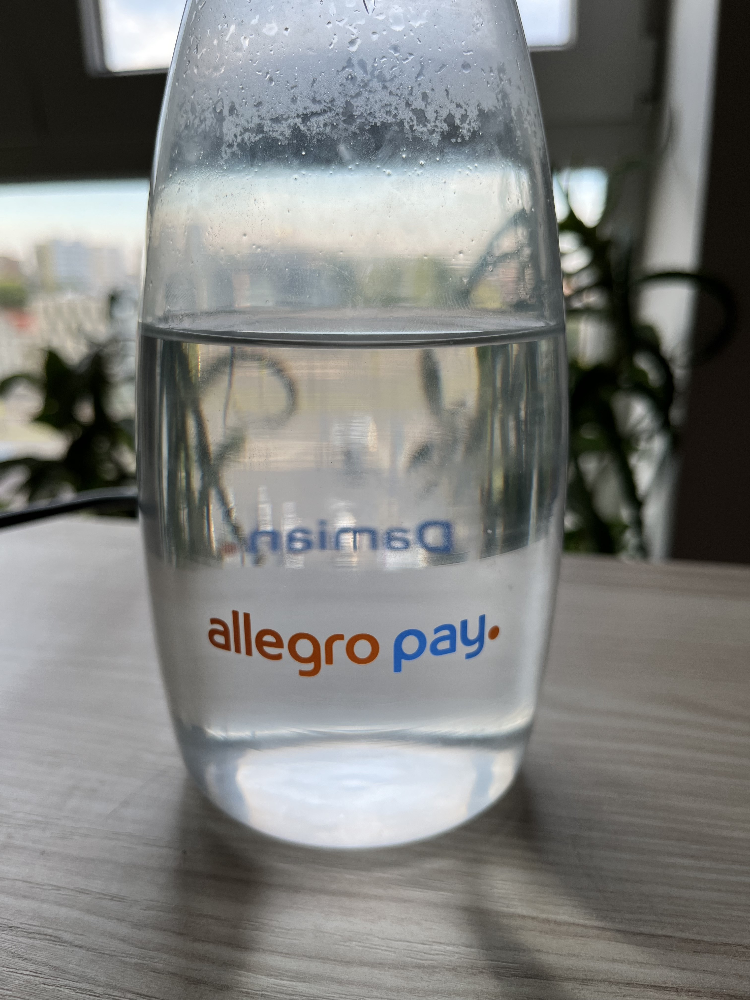

## Intro

In August 2021 [I left PwC](https://dskrzypiec.dev/leaving-pwc) and joined
Allegro Pay in role of senior data engineer. Allegro Pay is a fintech sub
company of biggest e-commerce in central Europe -
[Allegro](https://allegro.pl). I've worked there for a year and in this post I
want to summarized my experiences. 

## Onboarding and first thoughts

Onboarding process in Allegro took four (4) days! That was very smooth
introduction without any hassle. There was presentations about company culture,
history and so on. It was rather pleasant experience.

In contrast to PwC, Allegro is a tech company from the beginning. One of example
of the difference is that Allegro have crucial internal IT systems centralized.
Like identity and access management. In PwC it was more dependent on a team and
region. In Allegro it's centralized. If I needed some access I immediately know
where should I make a request. The same remains true for all HR systems.

In PwC we mainly have used email as communication medium. Internal communicator
was used only for quick chats. History older than a day was deleted from
communicator, so all important information was exchanged via email. In Allegro
people use Slack. There are support and help channels for everything. It's very
easy to browse through channels and find information or just ask. In PwC often
I wouldn't know who should I ask, so usually things were flowing through my
direct manager.

## New technologies

When I've joined Allegro Pay data engineering team mainly used the following
technologies: Snowflake, Airflow and dbt in purely data layer and besides that
C# microservices. The first three I've never used prior joining Allegro.

### Snowflake

We've used [Snowflake](https://www.snowflake.com) as our main source for all
analytical data and even a bit more. From all new technologies that I learned
at Allegro Snowflake was easiest for me. Basically it's a modern, distributed
data [warehouse | lake | store] done right. In almost all aspects using
Snowflake was pure joy. It's just works. Regarding compression, performance and
general convenience it's just great.

### Apache Airflow

[Airflow](https://airflow.apache.org) was our main orchestrator for data
pipelines. In fall 2021 we started using Airflow on Google Cloud Platform in
form of [Cloud Composer](https://cloud.google.com/composer). I even liked the
main idea besides the design of Airflow but it has unbelievably poor
performance. Even first version of Composer (on the Cloud!) didn't resolve
those issues. I definitely wasn't a fan of this one. On the other hand Allegro
also uses Airflow and we've got support regarding Composer from another team.

### dbt

We've tried using [dbt](https://www.getdbt.com) as an alternative solution to
improve effectiveness of local development of Airflow DAGs. First POCs were
successful, so we decided to use it in one of our processes. Basically we were
developing data pipelines locally using dbt and later on we automatically
generate Airflow DAG based on dbt models (also DAGs). So final product was
still data pipeline in Airflow but development process doesn't require local
Airflow instance and rather slow feedback loop.

## Flashbacks from consulting

In October 2021 [Allegro Pay signed the
deal](https://www.bankier.pl/wiadomosc/Allegro-Pay-ma-umowe-sprzedazy-wierzytelnosci-z-Aion-Bankiem-saldo-niesplaconych-wierzytelnosci-moze-siegnac-2-mld-zl-8203280.html)
with [Aion Bank](https://aion.eu) for selling some exposures. In general
Allegro Pay would get paid and Aion, as rather new bank, would get portfolio of
exposures. This project was important for Allegro Pay because at the time
Allegro was also [acquiring Mall
Group](https://about.allegro.eu/news-releases/news-release-details/allegro-acquire-mall-group-leading-e-commerce-platform-across).

So the project was very important, deadline was really tight (3-4 weeks) and I
was responsible for designing and implementing a process for exposures (in
tranches) evaluation. Based on this evaluation actual offers, in form of formal
legal documents, were prepared and sent to Aion. Pressure was very real. Based
on this evaluation Allegro Pay would received 100-200mln PLN (~$40mln USD) in
single payment.

Just three months after I've escaped consulting I got into a project almost
exactly the same I would expected to happen only in consulting. Nevertheless my
experience was very good fit and I knew that for Allegro this is very unusual
project so I did it. It was the only period in my time in Allegro when I had to
done overtime. It was very intense couple of weeks.

At the end we pulled it off before the deadline. Including very tough
constrains I think we did very solid job. There wasn't single major mistake
both in technical and business aspects. That was a great success. I think that
in a regular bank or even consulting the same project would take a least 3
months for consulting and at least 10 months for a bank.

## AMD

## Integrating delivery addresses

## My team and people

## Summary

