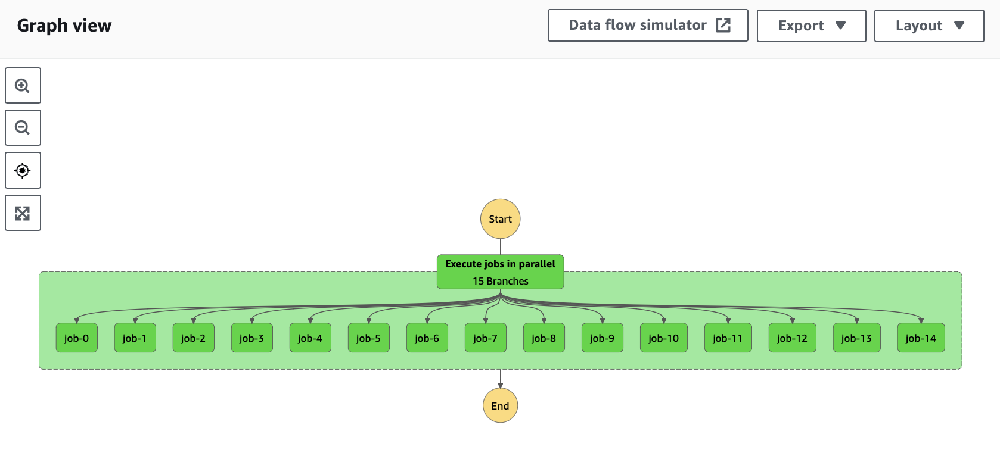

## Intro

I'd like to start this post from praising [AWS Cloud Development Kit](https://aws.amazon.com/cdk/) (AWS CDK). In my
opinion it's great! It's available in number of languages including Typescript, Go and Python. It has very good
documentation including examples and most common use cases.

If you're not familiar with AWS CDK, I'd say it's a library (or set of libraries) defining every service and its objects
(constructs) on AWS. It's obviously used to define infrastructure-as-a-code but it has strong advantages on other
template-based formats. This implementation is done using actual programming languages. What that means is you can
easily parametrize your infrastructure, write higher level abstractions, pack some functionalities into a common internal
library and even write unit tests for your infrastructure.

Almost all the time I've been using this piece of technology it was great but recently I've bumped into an interesting
case with [AWS Step Functions](https://docs.aws.amazon.com/step-functions/latest/dg/welcome.html). I've spend some time
debugging and fixing it, so I thought that could be also interesting for someone else.


## The problem

One of our data pipelines looks as follows: it is defined as AWS Step Functions graph which primarily contains many
parallel AWS Glue Jobs (using Spark in Scala). Each of this Glue Jobs are instantiated by the same definition of
transformation but with specific configuration. When we are extending this pipeline, we are extending
configuration in the AWS CDK project and new Glue Job would be created within CI/CD. Looking at the graph at the top
extending pipeline would mean adding another `job-i` to the graph.

So far so good but recently when I was, once again, extending this pipeline there was an error while deploying extended
version onto AWS. Error stated that [IAM](https://aws.amazon.com/iam/) role policy definition of this Step Functions
state machine exceeded its limit - `10240` characters. What? I didn't do anything regarding permissions or adding new
constructs to the graph. Why role policy definition would be changed? I have examined this CDK stack implementation at
angle of permissions. We've explicitly defined static role policy definition for Glue Jobs, the same for each glue job
in the DAG, and static permissions for S3 buckets. Yet somehow role policy definition kept extending alongside with the
pipeline.


## First observations

I started looking at the pipeline state machine role policies. It's turned out there were two. The first one was our
explicit definition which came from AWS CDK stack implementation. Another one had very long name with
`...RoleDefaultPolicyB345DSFGH96F` suffix. Looking at the definition of this policy I saw something similar to the
following


```
{
"Statement": [
    {
        "Action": [
            "glue:StartJobRun",
            "glue:GetJobRun",
            "glue:GetJobRuns",
            "glue:BatchStopJobRun",

        ],
        "Resource": "arn:aws-glue:<region>:<acc>:job/<env>-pipeline--table1",
        "Effect": "Allow",
    },
    ...
    {
        "Action": [
            "glue:StartJobRun",
            "glue:GetJobRun",
            "glue:GetJobRuns",
            "glue:BatchStopJobRun",

        ],
        "Resource": "arn:aws-glue:<region>:<acc>:job/<env>-pipeline--tableN",
        "Effect": "Allow",
    },
]
}
```

What I was almost sure immediately was the fact that this policy is automatically generated by AWS CDK based on Step
Functions state machine implementation. I was not sure if we messed something out in the implementation to cause
separate statement per table instead of getting resource path `.../<env>-pipeline-table*`.

So for over a year this never turned out. I was the (un)fortune one who's changed exceeded policy definition limit but
this behaviour was happening from the beginning.


## Trying to fix the problem

At the beginning I tried to check if there is something wrong with the way how permissions (role policy definitions)
were passed around in AWS CDK Stack implementation in Typescript. There wasn't any change on the output. Then, instead
of sharing single role policy definition among each Glue Job, I tried to dynamically define separate role policy
definition for each Glue Job. With the same definition but at separate object. It also didn't have any impact on the
problem.

I also tried to make some changes to role policy definition of the state machine but also without any results.
After that I've proceed to read all documentation regarding AWS Step Functions in general documentation and also
specific in AWS CDK documentation.


## Is there no solution?

After those initial tests and mini experiments I've seen that this auto-generated role policy definition for a state
machine includes necessary permissions for its children. Browsing through the documentation I was looking for if there a
switch to override this behaviour. One possible solution is to **manually** override policy definition after `cdk
deploy` but that is more of a workaround rather than actual solution.

I believe I've read all of AWS CDK documentation in this regard and sadly I think, for now, there is no solution for
this behaviour. Due to time constraints I couldn't spend another day on investigation. If I'm wrong, please write to me
with a hint of solution.

Overall it's very convenient that most of the time you don't have to think about "standard" permissions regarding
setting up a Step Functions state machine and everything just works implicitly. But if your are in one of those corners
it's a bit sad.

Finally I've solve this problem by splitting those Glue Jobs into separate state machines (three of them) by some
dimension. The main state machine have initial logic and then included those three sub state machines. If in the future
one of those sub state machine will grow significantly we will be back to the square one. I'm not really happy about
this solution but it was definitely better option then manually override role policy definition after each deploy.


## References

1. [AWS CDK](https://docs.aws.amazon.com/cdk/v2/guide/getting_started.html)
1. [AWS Step Functions](https://docs.aws.amazon.com/step-functions/latest/dg/welcome.html)
1. [AWS Glue Job](https://docs.aws.amazon.com/glue/latest/dg/add-job.html)
