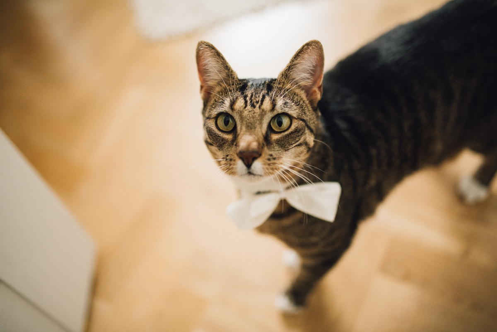
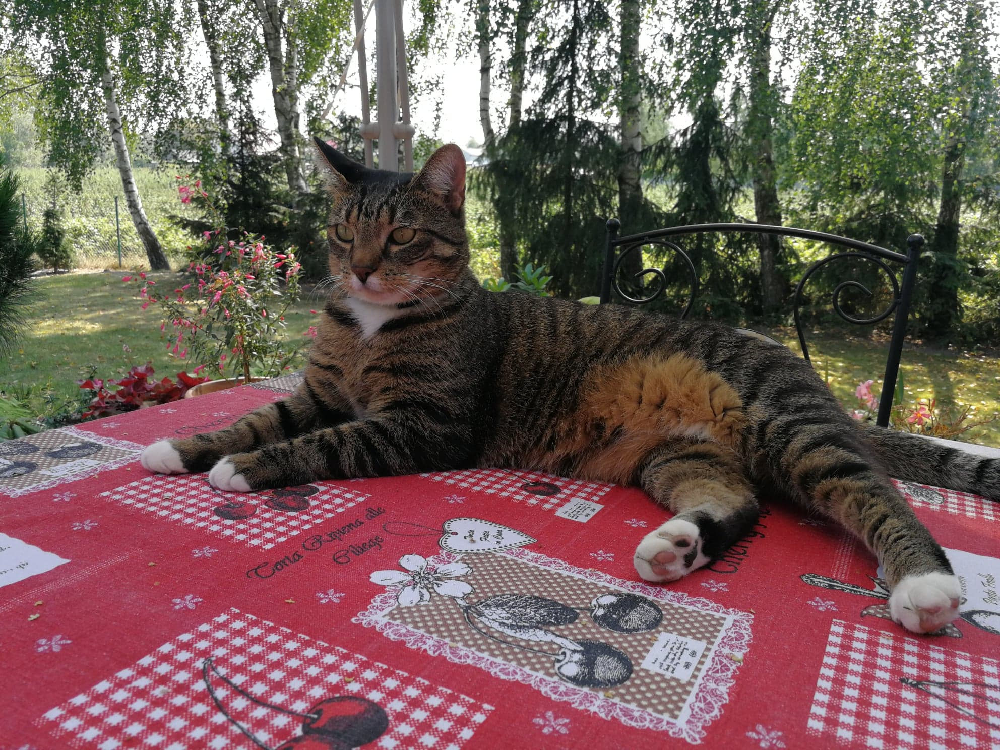

## Intro

Last Saturday, 17Th October 2020, Całka (one of my two cats) had to be put to sleep.
Name Całka translates from Polish to English as [Integral](https://en.wikipedia.org/wiki/Integral).
Me and my (at that time) girlfriend were maths undergrads when we've taken
Całka from animal shelter in early 2016. That probably explains the name.

For last two months Całka fought with really nasty jaw bone cancer. It was
growing fast. It was too big to even consider surgery. She was given
painkillers regularly and some other drugs but nothing more can be done in this
case. She was very strong. She fought twice as long as she was expected to by
the vet. At point when she start to eat less we've made the decision.

## Adoption

In late 2015 our first cat Leon have been in depression. In early 2016, after trying few
collars with pheromones we've decided to adopt a kitten from animal shelter.
We went for tiny kitten but we came back with six kilograms (thirteen
pounds) adult cat. She was the first cat which was introduced to us in the shelter. We
were sceptical but after she was gave to me and she started purring we've
change our minds.

When we come home Całka was almost twice as big as our first cat!
She was a bit lazy in comparison to Leon. Fortunately the main activity for
Leon was to fight and run with Całka. After about two weeks Całka started to
jump and run. At the beginning she was just laying on her back and try to fight
back using only her paws but without moving the body.

## Recollections

Całka didn't behave like a regular cat. She liked to come to you and cuddle.
She was purring very loud! As opposite Leon can be barely touched and only when
he wants to.

Back then when I was back home from university and there was another long night
ahead I liked to take a short nap. Całka almost always joined me for those
naps improving a lot quality of my sleep.

Całka could open closed doors. She was jumping on the door handle, catch it and
hang on it until door will open. She was very smart cat. Also she was always
hungry. Usually she ate her meal and Leon's.

She was always very friendly to all our guests. She always would come to the
door when someone was coming. She usually jump on the guest's laps, start
purring and wait to be pet.

When my son has started to walk our cats had a hard time. Even then Całka was
very patient. She let him lay down on her, grab her tail and paws. She never
bite or scratch him though she had a few good excuses to do so.

## Goodbye

I think Całka was very exceptional cat maybe because she didn't act like
regular cat. Before her I wasn't a cat person. Final day was very hard for me
and my family but it was the only option. She couldn't eat and she was lying
even though she was not sleeping. It was bad.

I'll never forget you Całcia!

