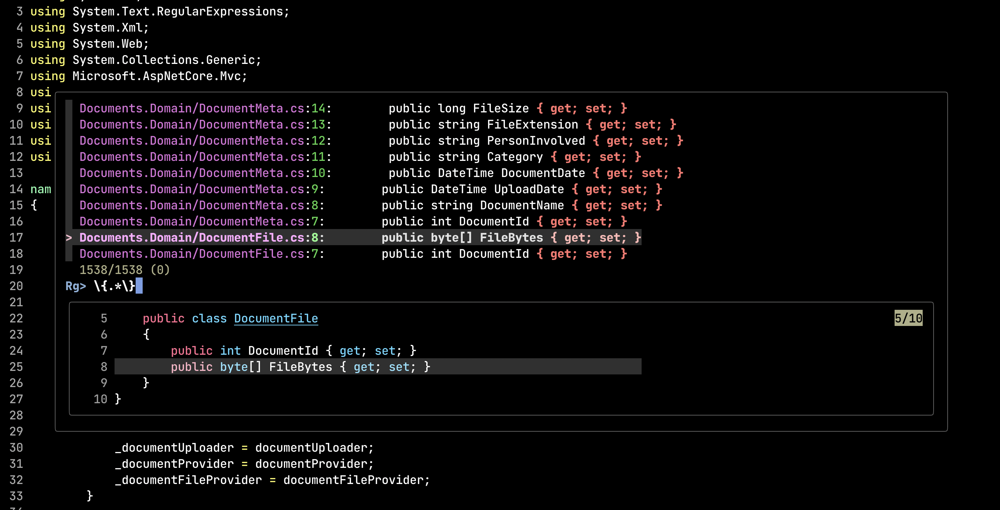

## Intro

I'll start by stating that I don't like fuzziness. It's the main reason I
didn't stick to machine learning and data science at the beginning of my
career. Instead I've transitioned to programming and data engineering.

And here I am writing about _fuzzy_ finder in Vim. That's because of
[fzf.vim](https://github.com/junegunn/fzf.vim) Vim package. It has some very
convenient feature that I have been looking for. More on this later in the
post. I still believe you should know (at least try to know) file tree
structure of a project your working on. Fuzzy finders might pull you away from
this practice very quickly. And I do think it's a bad idea.

However let's assume you have a firm grasp of your project's structure tree but
it's large project with very deep tree. In this case, when you know what you
are looking for, it might saves you time for typing long file paths.

Before I jump to _fzf.vim_ package let's discuss [fzf](https://github.com/junegunn/fzf)
first.


## _fzf_

Fuzzy finders in general helps you to look for a file or directory, usually in
an interactive manner, by just taking search phrases. They are usually search
down the tree of files recursively beginning from current catalog.

At I stated before I try to know the file tree. But in case I want to open file
in `./this/very/deep/file/path/location/project/sub/MyFile.cs` it is really
convenient to feed `MyFile` phrase to fuzzy finder to quickly go to that
location.

In case of _fzf_ I mostly use two aliases which uses _fzf_ to fuzzy find file
and open it in Vim and the other one is for jumping to found directory.


```
alias vf='vim $(fzf --height 40%)'
alias cdf='cd $(find . -type directory | fzf --height 60%)'
```

A little demo of the those aliases:

[](https://asciinema.org/a/hTYFpnEqIekVYmTV7c1xS9PCk)


## _fzf.vim_


## References

1. [fzf](https://github.com/junegunn/fzf)
2. [fzf.vim](https://github.com/junegunn/fzf.vim)
3. [ripgrep](https://github.com/BurntSushi/ripgrep)

