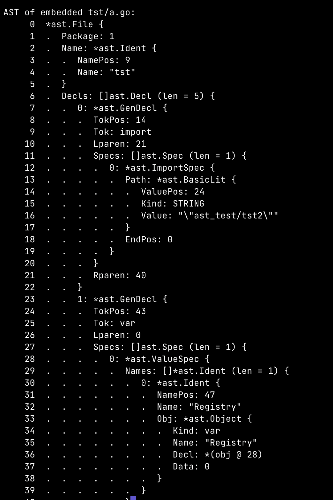

## Intro

Recently I thought I want to have a function, implemented in Go, which would return method's source code for given type
and method name in the runtime. Something of this signature:

```
func MethodBodySource(typeName, methodName string) (*ast.BlockStmt, string, error) {
    ...
}
```

This function would return found function body [AST](https://en.wikipedia.org/wiki/Abstract_syntax_tree) (which in Go is
block statement), it's source code as string and possibly an error.


In dynamically typed and interpreted languages this is a foundation functionality.
For example, in Python, it's enough to do the following:

```
import inspect

def func_source(f) -> str:
    return inspect.getsource(f)
```

In compiled languages this looks usually a bit more complicated and involves some kind of metaprogramming. I want to
have this function to detect whenever specific kind of methods in my project has been changed, to denote it in the
database (external persistent place for data really). I thought I would get the answer to my problem in an hour at
most using Stackoverflow, ChatGPT and Google. I was wrong. It took me a bit more. In the end the answer is not really
complicated but getting there took me few moments. Thus I thought it might be a good idea to summarize it in a blog
post.

On metaprogramming in Go there are several kinds available. Code generation via `go generate`, [reflective
programming](https://en.wikipedia.org/wiki/Reflective_programming) via standard `reflect` package and manipulation of
Go abstract syntax tree (AST) using `go/token`, `go/scanner`, `go/parser` and `go/ast` standard packages. For my
problem reflection and getting use of the AST sounds like perfect match. Usually I don't need to reach for
metaprogramming, so in case of this problem I thought it's a good occasion to explore those a bit deeper.


## High level approach

High level plan for implementing this function is really simple.

1. Get AST or set of ASTs for the project source code
2. Implement AST traversal for finding the right method (`*ast.FuncDecl`)
3. Return `*ast.FuncDecl.Body` (`*ast.BlockStmt`) and its serialization to a string


## Parsing AST of the project

Initially I thought I could simply use `go/parser` package to easily parse the whole Go project and I would get a
single big AST to work on. It turned out this package only supports [parser.ParseFile](https://pkg.go.dev/go/parser#ParseFile)
and [parser.ParseDir](https://pkg.go.dev/go/parser#ParseDir) functionalities for parsing single file or single
directory of files. At this point I thought I don't really know how Go exactly do the compilation.

As I learned ASTs are parsed for every Go file separately and basic unit is a Go package. That makes sense, because for
example methods for a single type might be scattered across many files within the package. But still on the package
level Go keeps a list of `*ast.File` ASTs rather then combining them into a single tree. Then type checking is also done
upon slice of ASTs.

Instead of manually parsing all `*.go` files I thought, perhaps, I could use already existing functionality which is
used by the compiler itself. I found [golang.org/x/tools/go/packages](https://pkg.go.dev/golang.org/x/tools@v0.12.0/go/packages)
package. As documentation states *Package packages loads Go packages for inspection and analysis*. In particular it
contains [packages.Load](https://pkg.go.dev/golang.org/x/tools@v0.12.0/go/packages#Load) function which loads packages
according to given configuration and returns slice of pointers to Package:

```
type Package struct {
    ID string
    PkgPath string
    Errors []Error
    TypeErrors []types.Error
    GoFiles []string
    ...
    Types *types.Package
    Fset *token.FileSet
    Syntax []*ast.File
    ...
}
```

As we can see it contains `Syntax` field which is a slice of ASTs of all `*.go` files in the package. To load all
packages in the current Go module (project) we can use a function similar to the following:

```
func projectPackages() []*packages.Package {
    cfg := &packages.Config{
        Mode:  packages.NeedFiles | packages.NeedSyntax | packages.NeedTypes,
        Tests: false,
    }
    pkgs, err := packages.Load(cfg, "./...")
    if err != nil {
        log.Panic(err)
    }
    return pkgs
}
```

The crucial configuration in here is adding `packages.NeedSyntax` to the `Mode`. Otherwise ASTs will not be parsed. Ok,
so at this point we have a slice of ASTs for our project. There are few minor caveats, but we'll come back to it a bit
later. Using `ast.Print` function we can print a AST in a pretty format:





Just for an illustrative example, if you would like to print ASTs for all parsed files, you can do something like that:

```
pkgs := projectPackages()
for _, pkg := range pkgs {
    for idx, astFile := range pkg.Syntax {
        fmt.Printf("Pkg: %s | File: %s\n", pkg, pkg.GoFiles[idx])
        ast.Print(nil, astFile)
    }
}
```

## Finding the right method in the AST

Once we have AST, finding the right sub-tree for given method and type name is rather straightforward. Especially in
case when we can just implement few examples and print its ASTs, to get familiar with types used in Go AST. Possible
implementation can look like the following:

```
func findMethodInAST(astFile *ast.File, typeName, methodName string) *ast.FuncDecl {
    for _, decl := range astFile.Decls {
        funcDecl, isFunc := decl.(*ast.FuncDecl)
        if !isFunc {
            continue
        }
        if funcDecl.Recv == nil || len(funcDecl.Recv.List) != 1 || funcDecl.Name.Name != methodName {
            continue
        }

        ident, isIdent := funcDecl.Recv.List[0].Type.(*ast.Ident)
        if isIdent && ident.Name == typeName {
            return funcDecl
        }

        // Check for *T receivers
        starExpr, isStar := funcDecl.Recv.List[0].Type.(*ast.StarExpr)
        if isStar {
            ident, isIdent := starExpr.X.(*ast.Ident)
            if isIdent && ident.Name == typeName {
                return funcDecl
            }
        }
    }
    return nil
}
```

A bit of explanations

1. Iterate over all declarations in AST (`*ast.File`)
1. Check whenever this declaration is a function declaration, if not continue to the next one
1. Check whenever this function has appropriate name and declaration has a receiver, to make sure it's a method and not free function
1. At this point we have two cases. Method can be defined on type `T` or pointer `*T`
1. In the first case we check if receiver type is an identifier (`*ast.Ident`) and then check it's name
1. In the other case we check for `*ast.StarExpr` and then take identifier from `*ast.StarExpr.X`
1. If any of those two cases type name matches given type name, we know we found the right sub-tree and can return `*ast.FuncDecl`

Overall, in my problem, we can assume that whole Go project was successfully compiled. In particular we can assume that
within single package pairs of types and methods and unique, thus we can return the first matching method in the AST is
the only one.


## AST to string serialization

As we would expect for AST serialization there is already implemented function in the standard library -
[printer.Fprint](https://pkg.go.dev/go/printer#Fprint) from `go/printer` standard package:

```
func Fprint(output io.Writer, fset *token.FileSet, node any) error
```

Argument `node` is any node of the AST. As we can see this function requires `*token.FileSet` which is an object that
keeps a slice of source files (`*token.File`). That's basically because `printer.Fprint` does not serialize AST just
based on its content but rather uses token positions from AST to read it from `*token.FileSet`. I'm guessing it's
mainly because to have mapping of AST nodes to concert file in the file system and lines in that file. Those are in
particular included in stack traces.

In case of parsing ASTs using mentioned `packages.Load` function there is single `*token.FileSet` per package which is
stored in `packages.Package.Fset` field. Knowing that we can go ahead and serialize AST of body of our target method
back into a string.

```
pkgs := projectPackages()
for _, pkg := range pkgs {
    for idx, astFile := range pkg.Syntax {
        helloMethod := findMethodInAST(astFile, "A", "Hello")
        if helloMethod != nil {
            var buf bytes.Buffer
            printer.Fprint(&buf, pkg.Fset, helloMethod.Body)
            fmt.Println(buf.String())
        }
    }
}
```

By default `printer.Fprint` prints tabs with width of 8 spaces. If you want to change it, you can do it like this

```
printerCfg := printer.Config{Tabwidth: 4, Mode: printer.UseSpaces}
printerCfg.Fprint(&buf, pkg.Fset, helloMethod.Body)
```

## Is it done?

It sounds like we implemented our sketched high level plan and in fact parsed all Go files in the project, found the
right method in the AST using reflection and finally serialize it to a string. If you want to easily run the full
example, you can pull it [from here](https://github.com/DSkrzypiec/blogSourceCodes/tree/master/20230820_GoAstMethodSource).

It was a good start, but as I mentioned earlier there is one downside of using `packages.Load`. That is it only uses
actual file system to load go files. It's configured by
[packages.Config.Dir](https://pkg.go.dev/golang.org/x/tools@v0.12.0/go/packages#Config) field. Additionally we can pass
patterns for Go file names matches in `packages.Load` function, but both settings are referring to files in the file
system. That means if I wanted to deploy my program which uses this functionally in the Docker container or remote
server I would need to also include project's source files. I don't like it at all! I'd say it's not acceptable for me.
Especially in Go where we end up with single statically linked binary. It was a good exercise to fool around with ASTs
and reflection, but can we improve the situation?

I think we have two possibilities. One is to either fork and modify `packages` package and try to extend it to also
accepts abstract file systems (like `embed.FS`) or to try starting a discussion on adding this functionality to the
package and then starting working on the PR. The second approach would be to abandon `packages` package and implement
simpler version - we just need to parse ASTs, based on embedded Go files in the binary. Considering amount of work of
the first approach and my specialized use case I decided to go with the latter.


## Embed Go files in the binary

In Go 1.16 [package embed](https://pkg.go.dev/embed) was added to Go standard library. It enables embedding files into
program target binary. Using this embedding all wanted go files from the project into the binary is as easy as this

```
//go:embed *.go tst/*.go tst2/*.go
var goSourceFiles embed.FS
```

There is no support for `./...` in `go:embed`. But that's not really a problem, because we know even before compilation
which catalogs from the project we want to include in the target binary, so we can list them manually. That was the
easy part. A bit more challenging would be adjusting `packages` package to use in-memory file system. Fortunately for
my problem we don't really need it. Mentioned package does much more then just parsing package's file ASTs. It also
perform type checks, let you choose which information about the package and files you want to load and much more. In my
case perhaps, it's enough to embed source files and use standard `go/ast`, `go/token` and `go/parser` packages? I think
so. I won't put whole implementation of this approach in here, but just an example how to mimic `packages.Load`
function regarding parsing ASTs for given packages based on embedded `goSourceFiles` and `tst` package.


```
type PackageSimple struct {
    Fset       *token.FileSet
    FileToASTs map[string]*ast.File
}

func tstPackageEmbedded() (PackageSimple, error) {
    fset := token.NewFileSet()
    fileASTs := make(map[string]*ast.File)
    entries, _ := goSourceFiles.ReadDir("tst")

    for _, entry := range entries {
        fullName := "tst/" + entry.Name()
        data, _ := goSourceFiles.ReadFile(fullName)
        astFile, err := parser.ParseFile(fset, entry.Name(), data, parser.AllErrors | parser.ParseComments)
        if err != nil {
            return {}, err
        }
        if astFile != nil {
            fileASTs[fullName] = astFile
        }
    }
    return PackageSimple{Fset: fset, FileToASTs: fileASTs}, nil
}
```


## Summary

This exercise turned out to be even more fun than I expected! I learned about initial Go compilation phases (lexing,
parsing, type checking), a bit more about reflection and got deeper insights on Go AST. I'm glad that I solved my problem
of getting method's source code in the runtime. I think that this hands-on experience with Go AST might become handy in
the future.


## References

1. [Go project with full example](https://github.com/DSkrzypiec/blogSourceCodes/tree/master/20230820_GoAstMethodSource)
1. [AST](https://en.wikipedia.org/wiki/Abstract_syntax_tree)
1. [golang.org/x/tools/go/packages](https://pkg.go.dev/golang.org/x/tools@v0.12.0/go/packages)

