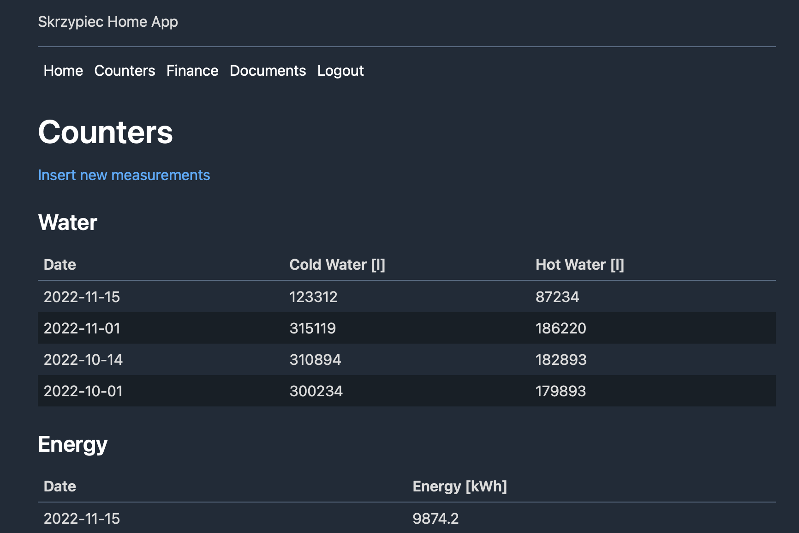
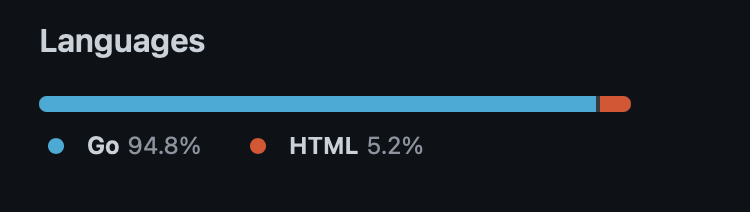
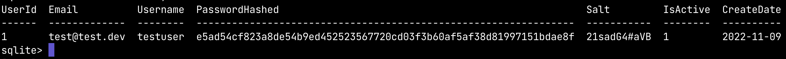
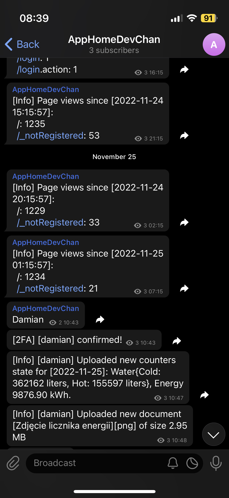

## Intro

Two years ago I've introduced [Home Database](https://dskrzypiec.dev/home-db)
with corresponding Home App written in ASP.NET Core MVC (C#). The original idea
was to have a database for keeping very personal documents and other data
related to me, my home and my family. More about motivations can be found
in the linked post about Home Database.

In case if you want to explore dev version of Home App before reading this
post, you can visit

* [https://homeappdev.dskrzypiec.dev](https://homeappdev.dskrzypiec.dev)
* and use credentials `testuser/password`

Or you can compile it from [source code](https://github.com/dskrzypiec/homeAppGo) and run locally.


## Home Database after two years

Even though development of Home App stuck a bit, we were actively using it. Over
past two years we gathered around 230 scanned (or in digital version)
documents, almost 4500 bank transactions and kept record of our water and
energy counters. Home Database has increased in size from ~50 MB to ~300 MB.
I'm glad that it didn't turn out as a regular side project which is parked
indefinitely.

It become a really handy when I had to pick up some of those
documents. It happens more often than I initially expected. Also, as it turned
out, almost always digital version is sufficient and there is no need for
physical copy. While changing companies I had to provide diplomas and other
documents. Moreover I was required to fill many legal forms. All of it I've
done using documents from Home Database and it took me significantly faster
without any effort comparing to browsing through stacks of paper documents.

## Why v2?

Regarding original version written in C# I haven't made a single commit since
mid-June 2021. It's hard to describe why exactly. I was thinking about
developing new features but I didn't want to continuing doing so in ASP.NET.
Perhaps it wasn't fun anymore? I'm not sure. Nevertheless recently I though it
would be better if I rewrite this app in Go. Firstly, because I was convinced
that in this framework I would want to continue developing the app. One might
ask why suddenly I've changed my mind, because I considered Go in 2020 and I
didn't go for it. There are three reasons

1. Now there is a [Go driver for SQLite](https://pkg.go.dev/modernc.org/sqlite)
   without using *cgo*
1. I've tested that using [html/template
   package](https://pkg.go.dev/html/template) with basic CSS might get pretty
   good UI
1. Moving Home App online

In 2020 the first two points were not met, therefore I choose C# over Go.
Regarding moving online. In the first version Home App was hosted on my RPi
within Tailscale network, so only handful of devices could access the
application. It was fine for me, but for other users (my wife) it was rather
poor UX.


## Migration to Go



### MVC

Regarding high level design in both C# and Go versions I've implemented
[MVC](https://en.wikipedia.org/wiki/Model–view–controller) approach. It's
suitable because of two reasons. The first one is that I don't do much frontend and
the other one is fact that Home App is, and probably will be, rather straightforward
application regarding UI and UX.

In Go I've used standard `html/template` package for generating HTML templates
and then rendering those using populated models. This package supports
including other templates, conditional expressions, using variables and looping
over collections. That's definitely enough for my needs. One of Home App pages
is generated using the following HTML template:

```
<!DOCTYPE html>
<html>
<head>
    {{ template "common-header" }}
    <style>
        {{ template "common-css" }}
    </style>
</head>

<body>
    {{ template "common-logo" }}
    {{ template "common-menu" }}
    <h1>Finance</h1>

    <table>
        <thead>
            ...
        </thead>
        <tbody>
        {{ range .MonthlyAggregation }}
            <tr>
                <td>{{.YearMonth}}</td>
                <td>{{.NumOfTransactions}}</td>
                <td>{{.Inflow}}</td>
                <td>{{.Outflow}}</td>
            </tr>
        {{ end }}
        </tbody>
    </table>
</body>
</html>
```

It's concise and simple. There are some other templates included for common
components and in the body we have a table generated based on
`MonthlyAggregation` object which is prepared in corresponding controller.

In case if you're interested in reading more details:

* All Home App HTML templates are defined [here](https://github.com/DSkrzypiec/homeAppGo/tree/main/html)
* All Home App controllers are defined within `homeApp/controller` package
  [here](https://github.com/DSkrzypiec/homeAppGo/tree/main/controller)

### SQLite and new driver

In May 2022 I found out that there is a [SQLite Go
driver](https://gitlab.com/cznic/sqlite) which doesn't require C and *cgo* to
compile. This package was done by automatic translation from C to Go. I think
it's impressive! As expected this translation should be slower then actual
hand-written C code, but [this
benchmark](https://datastation.multiprocess.io/blog/2022-05-12-sqlite-in-go-with-and-without-cgo.html)
shows it's not that bad. Regarding Home App use-case that will be sufficient.
Usually I'm not a fan of moving cost from compile-time to run-time but in this
particular case keeping development process as smooth as possible is more
important, than a bit slower `INSERT`s (which are performed at most few times
per week).

### HTTP backend

Most of backend code in Home App is related to accessing Home Database within
HTTP handler and read or insert data. So almost everything touches networking
layer in some sense. For now there was only one component which was separated
and needed actual migration between projects. It's parsing PKO Bank XML dump
file with transactions. This parser was rather small peace. I've migrated it
using standard `encoding/xml` Go package in single evening (including unit
tests).

In general I feel that `net/http` library is a bit more pleasant to use
comparing to ASP.NET. I feel that Go `net/http` is a bit lower level of
abstraction then ASP.NET and I prefer it this way. Although I might be a bit
biased, because I've spent more time in the past in networking in Go, than in
C#.

### Full text search on documents

It's not directly related to Go but I've planned to do this for a long time and
`v2` was the best opportunity to do it. SQLite provides full text search
capability via [FTS5 extension](https://www.sqlite.org/fts5.html). Using it in
SQLite is as easy as creating a corresponding virtual table

```
CREATE VIRTUAL TABLE IF NOT EXISTS documentsFts5 USING fts5(
    DocumentId,
    DocumentName,
    UploadDate,
    DocumentDate,
    Category,
    PersonInvolved,
    FileExtension
);

```

As you can see for now full text search is performed over documents metadata
(title, dates, category, person, etc.) and not its content but still it's good
enough (for now) to browse documents.

The only cost of *FTS* is keeping documents metadata duplicated, but in my
opinion it's rather small cost for convenient google-like searching integrated
in a half an hour.


## Home App v2 features

* Hosted online (new in v2)
* Two-factor authentication (2FA) via Telegram (new in v2)
* General statistics on home page (new in v2)
* View/insert counters state (water, energy)
* View statistics and insert financial transactions from [PKO
  Bank](https://www.pkobp.pl)
* Inserting new documents
* Browsing documents using full-text search (new in v2)
* Downloading documents
* [coming soon] book catalog with possibility of including and downloading e-books


## Going online

For the last two years I've been hosting Home App and Home Database on a RPi in
my home. During this period I had around 2-3 days of downtime totally. One of
outages happened when I was two hours drive from home. After this incident I
started to thinking about moving the application into the cloud. I could invest
in some kind of UPS, but that wouldn't solve all problems. There was still a
factor that application could be reached only within Tailscale network. The
main problem with this approach is that to access Home App in some device I
have to install Tailscale and login on that device. This is not a major problem
but it's less flexible than just a web application.

The new architecture of Home App is really simple. Application is hosted on AWS
EC2 (compiled app + Home Database). To that EC2 I have load balancer attached
to setup TLS (HTTPS). Finally this load balancer is setup with Amazon Route 53
where my personal subdomain for the application is registered.

I've setup two environments - dev and production. The dev environment was
already mentioned - [https://homeappdev.dskrzypiec.dev](https://homeappdev.dskrzypiec.dev).
I thought that is a good idea to share dev version of Home App which uses mock
database without any sensitive data. For development process it's good that I
can test process end-to-end on separated environment. The other reason is that
if someone was interested in deploying their own version of my Home App, using
mock database at the beginning should provide smooth introduction.


### Authentication

Once the infrastructure for cloud-based online version of Home App was setup
only one thing was missing - user authentication. In the RPi version there was
no need for authentication, because it was handled by Tailscale.




I've implemented rather standard user authentication where salted and hashed
password is checked against original salted and hashed password from the Home
Database. There is also second step of authentication (2FA) which requires that
user have to send specific message on private [Telegram](https://telegram.org)
channel within a minute. On dev environment 2FA is turned off. More on Telegram
integration in the next chapter.

In current version I've decided that there is no need for new user registration
capability. All users that shall have access to Home App are added manually by
the admin directly to the table in Home Database. Regarding 2FA all privileged
users should also be added to the private Telegram channel.


## Security

Security of Home Database is still very important factor. Exposing Home App v2
to the World created many security scenarios that have to be covered.

The first one was how to keep "the server" with application and the database
protected. In order to do so I've setup that connection to Home App EC2
instance can be performed only via SSH using my private RSA key only from my IP
or via HTTPS directly to Home App. So even when someone could get my RSA key
for this instance he/she should have also get into my AWS account or using the
same IP. Both are possible but very unlikely.

The other matter was protection of the Home App itself. Beyond standard user
authentication I've introduced second step of authentication via private
Telegram channel. After successful authentication user got short-lived session
token (10-15 minutes) via HTTP-only cookie. Moreover every endpoint, except
login form, of Home App is protected by checking validation of session token.

I'm not a security expert so this might not be a state-of-the-art setup but
with combination of monitoring I feel rather safe. Still it would be simpler to
break into my home and take part of those physical documents rather than
hacking Home App.


## Telegram



I choose Telegram for 2FA and notification, because it's the main communicator
I'm using together with my wife and the rest of the family. I have it installed
on my mobile and also it can be accessed via web version, so it's always within
my hand's reach. It's also much less of a hassle for other users in my family
then using Tailscale.

Primarily Telegram was choose for second step of 2FA. Later I thought it's also
very convenient way to notify me and other users regarding activities and
statistics.


## Summary

I'm really excited about both putting Home App online and migrating it to Go.
At the moment Home App is rather a simple web application, thus migration took me
less then three weeks of evenings and not every evening in that period. In
current Go version I feel like adding new things and maintenance in general
would be more pleasant for me.

Additionally for me this migration was a good learning experience. Where on the
backend side I've implemented similar things many times, there on the other
side it's my first application that is hosted in public.

I'm very happy that Home Database is alive and growing. I hope that with
current better accessibility and availability of Home App it will bring much
better experience for me and my family. I can feel it already but we'll see how
it turned out in the future.


## References

1. [Home Database and Home App v1](https://dskrzypiec.dev/home-db)
1. [Home App v2 repo](https://github.com/dskrzypiec/homeAppGo)
1. [Go SQLite drivers benchmark](https://datastation.multiprocess.io/blog/2022-05-12-sqlite-in-go-with-and-without-cgo.html)
1. [modernc.org/sqlite driver](https://pkg.go.dev/modernc.org/sqlite)
1. [SQLite FTS5](https://www.sqlite.org/fts5.html)
1. [Telegram Bots API](https://core.telegram.org/bots/api)
