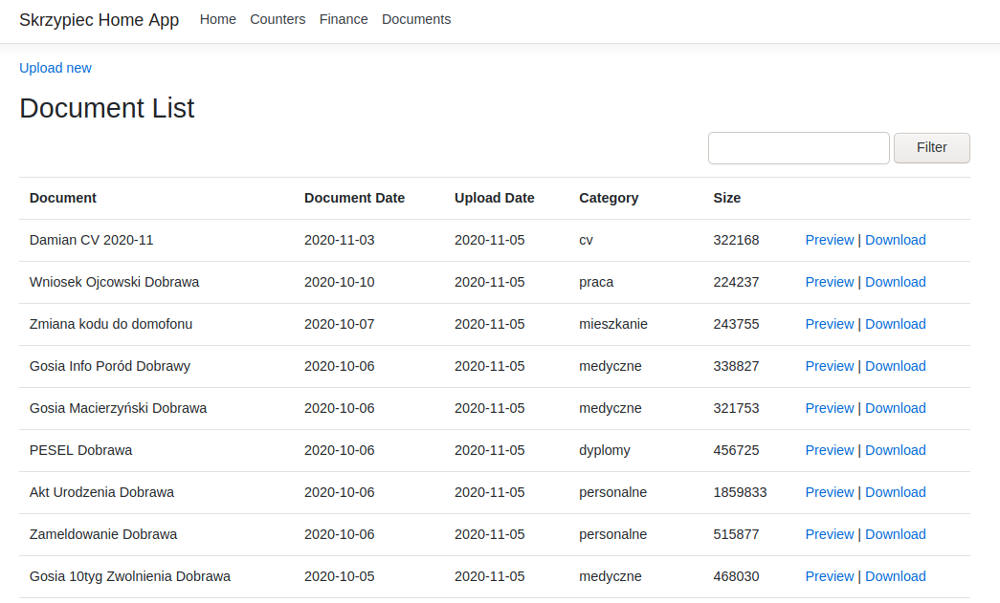
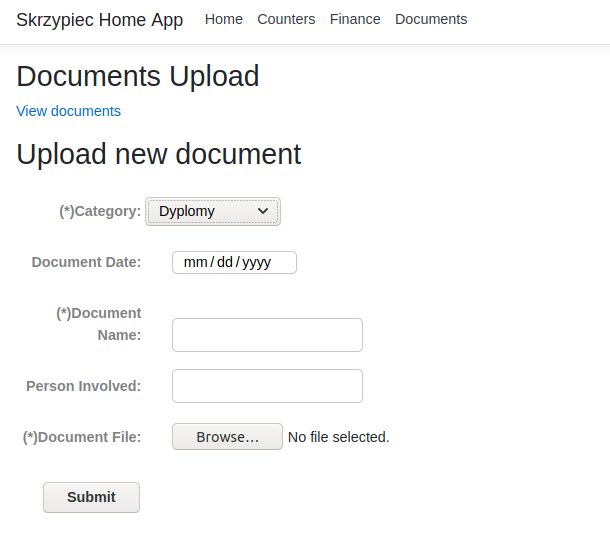

## Intro

Last month after my daughter was born we've received a bunch
of documents in this matter. Birth certificate, medical papers
assignment of [PESEL](https://en.wikipedia.org/wiki/PESEL),
etc. When I was about to put those papers into document folders
I thought it's time for digitalization.

Most of our very important documents like mortgage papers or university
diplomas exist only in physical version without any copy either digital or
physical. We had in plans to scan or at least make a photo of those but we
didn't do it. Therefore I thought let's make this right.

Besides documents, in so-called *HomeApp* I would also want to keep track of
usage of water and energy in our home, bank transactions history and list
of our books.

## The database

I want my **homeDB**, yet abstract bag for home data, to be:

* in form of a single file
* accessible on multiply platforms and devices
* structured
* free

Based on those criteria I choose [SQLite](https://www.sqlite.org/index.html).
It works everywhere, it can store files in a raw format (blob), it's
self-contained, it's free and it's probably
[the most tested](https://news.ycombinator.com/item?id=18685748)
non-trivial program ever written. I also personally like SQLite for being
minimalistic. Setup is trivial or even nonexistent.

At the end of (any given future) day I'll be having a single database file
containing all of my and my family important files from our adult life.
That sounds serious. We'll back to that in *Security* section.

Wait... But how can I upload my files and data to this database? Yep, I'm also
developing **HomeApp**.

## Home App

## Data uploading

## Security

## Summary

