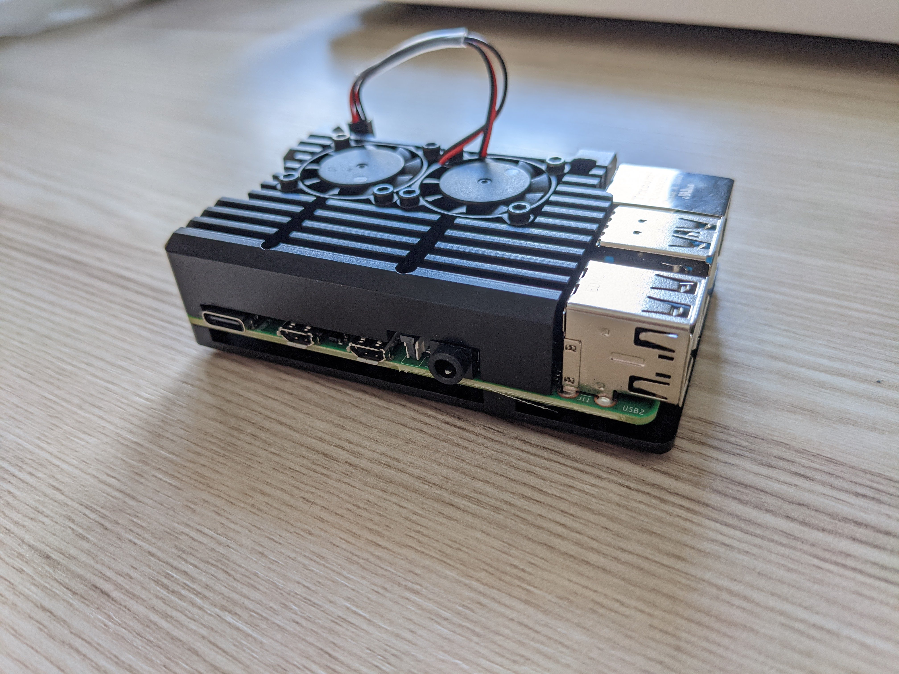

## Intro

I've finally setup my own server. It's great and I regret I haven't done it
earlier. This post will be about my thoughts and experiences on setting up a
home server.

In my case a __server__ is just a Raspberry Pi 4B so it's not a typical server
with over 40 CPU cores and over 256 GB of RAM but technically it's still a
server and it's enough for my use.

For a while I though to make my [PC](https://dskrzypiec.dev/minipc) a home
server but Ryzen 3700X definitely needs more power than Raspberry Pi and is
probably overkill for a server used mainly by 1-3 users.

## Architecture

It is easy enough to buy a Raspberry Pi and set it up in local network but in
my opinion it's useless when you cannot connect to it securely outside of your
local network. That's why I needed some kind of _Virtual Private Network_ (VPN) for
the server and my other devices.

I choose [tailscale](https://tailscale.com). I don't have much experience in
VPN tools but this one is a really good tool. At least two ex-Googlers from Go
team ([Brad Fitzpatrick](https://github.com/bradfitz)
and [David Crawshaw](https://github.com/crawshaw)) hacked on this.
In my opinion it's good because of the following reasons:

1. _Just workz_, on most operating systems and CPU architectures
1. Minimalistic and lightweight
1. Zero config
1. Provide static IP for each device within the network
1. Free (as in price) for my usage (single user, many devices)

So in this architecture I can connect to the home server over SSH from any
device which has _tailscale_ installed. All my laptops and PC already had
_tailscale_ installed. Furthermore my android smartphone have _Termux_ and
_tailscale_ on it, so I can also use the server directly from my smartphone.
Which is really cool, even better than
[writing blog post on smartphone](https://dskrzypiec.dev/smartphone).

## Setup

Before my ordered Raspberry Pi arrived I've already installed Ubuntu Server
20.04 on a microSD card (default RPi storage). This was my first experience
with Ubuntu **Server**. It's just like a regular Ubuntu Desktop but without any
unnecessary bloat like UI and default software and GUI programs. So basically
you got a Linux terminal with \*NIX tools. At this price OS have significantly
smaller footprint than regular Ubuntu. Running server version consumes only
about `200MB` of RAM.

On the day when RPi arrived I've prepared OS so I could start with setting up
the environment. In just under two hours I manage to:

1. setup basics for Linux like `.bashrc` with my aliases and `.vimrc` with my setup
1. install .NET Core 3.1
1. install tailscale
1. install [Tarsnap](https://www.tarsnap.com) and configure my private key
1. restore latest backup of the [Home DB](https://dskrzypiec.dev/home-db) via Tarsnap
1. clone repo of my Home App and successfully compile the project (RPi is ARM
   based CPU)
1. adjust configs of Home App and run it in the background
1. test SSH and port forwarding from another devices
1. access Home App from my smartphone via SSH port forwarding inside my VPN

I was very surprised that I've manage to pulled it off in just one evening.
Another evening and I've setup scripts for automated backups and some utility
scripts to my convenience while using the server from mobile devices.

## Security

The server uses two level of security. The first is VPN and another is SSH. As
I mentioned before I use tailscale to create a VPN for my devices. For details
how tailscale works I recommend
[this](https://tailscale.com/blog/how-tailscale-works/) article.
In order to connect to my server client device have to be authorized by
tailscale. To connect within the VPN a device to the server SSH is used.

So my Home DB still lives only on my _local_ device which happens to be secured
server. In order to access Home App I've to use SSH port forwarding from
server's _localhost_ port onto SSH client port. Practically that means I still
use my Home App in local environment but in help of VPN and SSH protocol I can
securely access the app from another devices.

Regarding secure online backups I still use Tarsnap.

## Why this instead of the cloud?

Why setting up your own server instead of just use one of _clouds_?
Main reason was to keep my Home DB private. In theory I could store my database
in encrypted form on the cloud and make Home App to handle decryption.
But at this moment I'm not able to do that properly, according to security best
practices. Second reason is that I feel less dependent on the others. I don't need
the key feature of the cloud infrastructure which is easy scalability. By
definition Home App and Home DB will stay local.
Last but not least electricity and cost of Raspberry Pi is much lower than
keeping up virtual machine 24/7/365 for significant period of time.

## Usage

As I stated before this Home Server serves mainly my Home App and Home DB.
But this service is very low request per seconds. I could say it's rather
(few) requests per day. That gives a lot of room for other stuff.

Additionally I store on the server mirrors of my GitHub repos and other side
projects. I've set up environment for compiling projects in technologies I use
in case I'd need to check something remotely.

I feel that possibilities are endless and I just started exploring them.

## Summary

