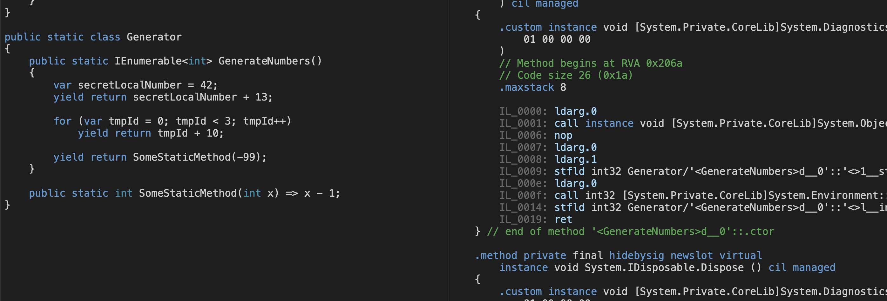

## Intro
Main goal of this post is to present how iterators actually works in C#. In
particular we will take a look on
[IL](https://en.wikipedia.org/wiki/Common_Intermediate_Language) (Intermediate
Language) generated by the compiler to check out what is really going on.

But first let's start from loosely stated definition of iterators in C#.
An *iterator* is a method or property which returns `IEnumerable<T>` or
`IEnumerator<T>` and uses `yield return` or `yield break` contextual keywords.
One could ask what is then a difference between an iterator and a method that
returns `IList<T>` which also satisfies `IEnumerable<T>` interface? The main
difference is the way of consumption of those sequences. In case of `IList<T>`
actual memory is allocated for all elements. In case of iterators we are
dealing with so-called lazy evaluation. Object from the sequence is taken only
when it's needed.

To express this difference let's consider the following silly example:

```
public static IEnumerable<int> PrepareNumbers(int n)
{
    var numbers = new List<int>(n);

    for (var i = 0; i < n; i++) {
        numbers.Add(i + 13);
    }

    return numbers;
}

public static IEnumerable<int> GenerateNumbers(int n)
{
    for (var i = 0; i < n; i++) {
        yield return i + 13;
    }
}
```

```
const int size = int.MaxValue;

var numbers1 = PrepareNumbers(size);
var numbers2 = GenerateNumbers(size);

```

Method `PrepareNumbers` allocates in this case over two billions `int`s so it
should throw `System.OutOfMemoryException` on systems with `8GB` of RAM or
smaller. But that is not a case for `GenerateNumbers` because iterator doesn't
perform any allocation for their elements. How C# compiler is doing that? There
can be (almost) any C# code within the iterator method. So how in fact C#
compiler know how to prepare the sequence without preallocation? Let's found
out.

## Consumption of `IEnumerable<T>`

Before we jump into details of iterator blocks I wanted to make sure we are all
familiar with the fact how actually `foreach` is consuming sequences of
`IEnumerable<T>`.


```
foreach (var item in sequence) {
    Console.WriteLine(item);
}
```

The above loop over all elements in the `sequence` is just syntactic sugar for
the following:

```
using (IEnumerator<T> enumerator = sequences.GetEnumerator()) {
    while (enumerator.MoveNext()) {
        var item = enumerator.Current;
        Console.WriteLine(item);
    }
}
```

In each loop iteration the `MoveNext()` method of enumerator is called and
current element is taken using `Current` property. Based on this we can suspect
that all of iterator "magic" is behind `MoveNext()` method.


## Internals of iterators

To study internals of iterators let's focus on single static method with
iterator block.

```
public static IEnumerable<int> GenerateNumbers() {
    var secretLocalNumber = 42;
    yield return secretLocalNumber + 13;

    for (var tmpId = 0; tmpId < 3; tmpId++)
        yield return tmpId + 10;

    yield return SomeStaticMethod(-99);
}
```

Iterating over `GenerateNumbers()` result would produce the following sequence
`{55, 10, 11, 12, -100}` (assuming that `SomeStaticMethod` decrease its argument
by one).

In order to look into the iterator block we will take a look on IL generated by
C# compiler. IL might be generated from .NET binaries using tool _ildasm.exe_
on Windows or _monodis_ on Linux and macOS. For small examples very convenient
way to look at IL based on C# code is online service [sharplab.io](http://sharplab.io).
Disclaimer: in the following IL listings I simplified names of objects to make
those more readable. However it's not identical with generated IL.

Let's start from the very top and find out what is under the hood of
`GenerateNumbers` method.


```
IL_0000: ldc.i4.s -2
IL_0002: newobj instance void _GenerateNumbers::.ctor(int32)_
IL_0007: ret
```

Those three instructions creates new object of class `_GenerateNumbers` using
constructor with value `-2`. Interesting! As it turns out C# compiler generates separate
(nested, private, sealed) **class** for `GenerateNumbers()` method. This class is
of the following form


```
private sealed class _GenerateNumbers
    : IEnumerable, IEnumerable<int>,
      IEnumerator, IEnumerator<int>,
      IDisposable
{
    private int _state;
    private int _initialThreadId;
    private int _secretLocalNumber;
    private int _tmpId;

    public int Current { get; }

    public _GenerateNumbers(int state) { }
    public void Dispose() { }
    public bool MoveNext() { }
    public void Reset() { }
    public IEnumerator<int> GetEnumerator() { }
    public IEnumerator GetEnumerator() { }
}
```

Set of interfaces which generated class satisfies isn't surprising. What was
interesting to me is the fact that this generated class captures all local
variables from original method `GenerateNumbers()`.

As we saw earlier two methods are especially important `GetEnumerator()` and
`MoveNext()`. The first one is executed once per consumption to get
`IEnumerator<T>` however `MoveNext()` is heavily used - in each iteration.
Next we'll take a look on `GetEnumerator()` but we'll mostly focus on
internals of `MoveNext()` method.

### GetEnumerator() method

This methods returns an instance of `_GenerateNumbers` class with set `_state`
pseudo code is as follows

```
if (_state == -2) {
    return new _GenerateNumbers(0);
}

if (_initialThreadId != get_CurrentManagedThreadId()) {
    return new _GenerateNumbers(0);
}

_state = 0;
return this;
```

So eventually we end up with an instance of `_GenerateNumbers` with set
`_state = 0`. The only difference is whenever we can use existing instance or
produce the new one. Finally after the line

```
using (var enumerator = GenerateNumbers().GetEnumerator())
```

object `enumerator` is the instance of `_GenerateNumbers` with `_state` set to
zero. Now we can proceed to using our `enumerator` to iterate using
`MoveNext()` method. Let's dive deep what is under this method.


### MoveNext() method


## File iterator

## Composition and Linq

## References

1. ["C# In Depth" - Jon Skeet](https://www.manning.com/books/c-sharp-in-depth-fourth-edition)
