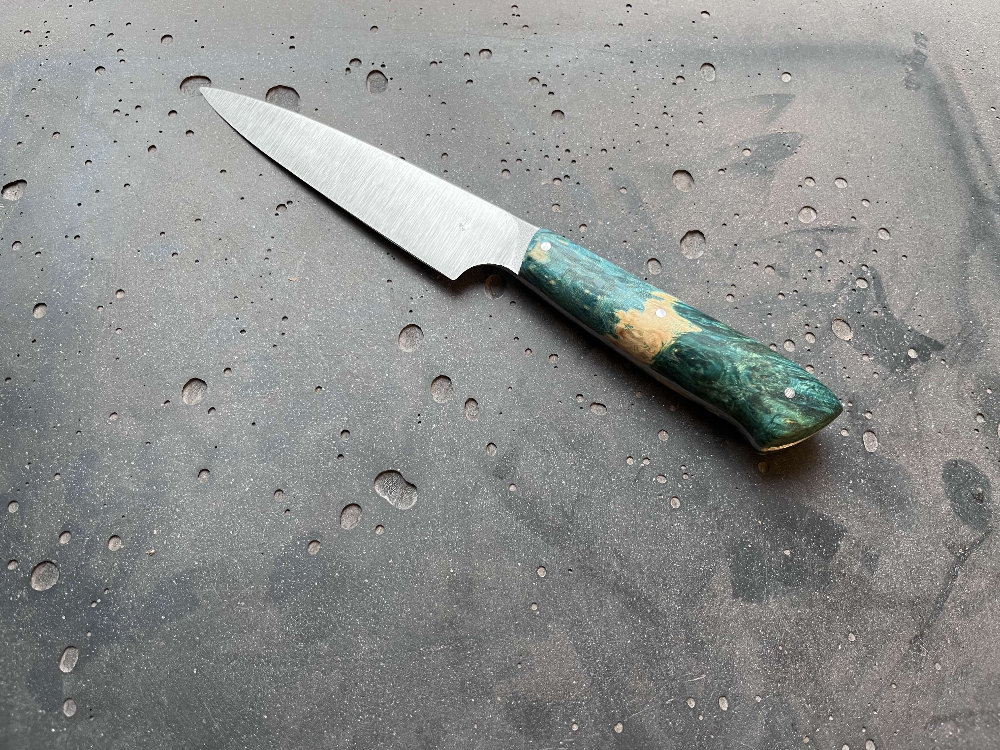

## Intro

On a November weekend, I participated in a knife-making workshop. This
experience was a gift from my wonderful wife. The workshop took place in Warsaw
and was conducted by [Kłosy](https://klosy.pl/).

## Getting Started

We began on Saturday at 9:00 AM by choosing the material for the knife handle
and the size of the knife. The options included a small kitchen knife, a forest
mushroom knife, and a chef's knife. I chose cherry wood stabilized with
colorful resin and opted for the small kitchen knife. The steel we used was
[N690](https://steelsnob.com/n690-steel/).

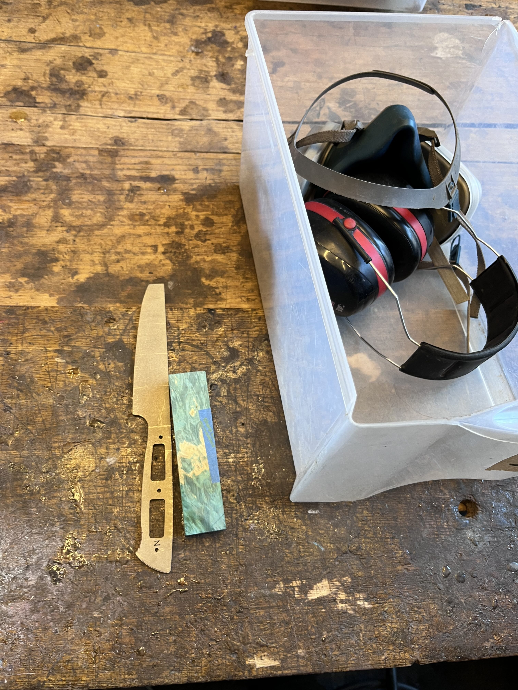

Before starting the actual work on the knife, we received a brief theoretical
introduction about different types of steel, blade shapes, and safety
guidelines. Then, we learned how to operate belt grinders and change their
belts. Following this introduction, we started working on the knife blade.
Initially, we practiced on a softer piece of steel to gain confidence with the
grinder. Once we mastered the technique and achieved the desired blade shape on
the practice steel, we moved on to the actual blade.

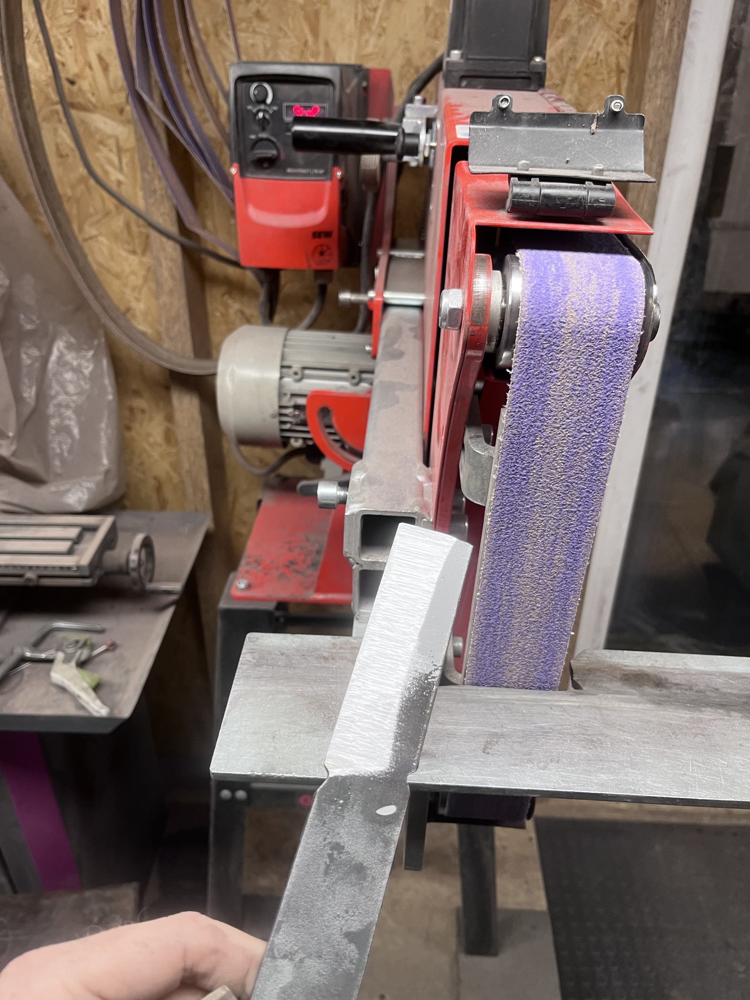

## Working on the Blade

The first step in working on the actual blade was shaping its profile. This
took significantly longer (about 2-3 hours) than the practice steel, as the
final steel was hardened. After the first hour, I felt much more comfortable
with the grinder. Gradually refining the blade's shape became a pleasant
experience—precise, repetitive movements requiring focus. It was quite
zen-like.

Once the profile was completed, it was time to choose the blade's shape. There
were plenty of templates to choose from, and we could also design our own.
Shaping this part of the blade went relatively quickly.

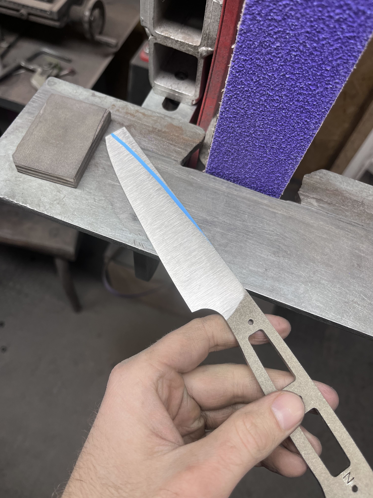

At this stage, the blade tip was left unsharpened to avoid potential injuries
during further work on the knife.

By around 1:00 PM, the blade was ready:

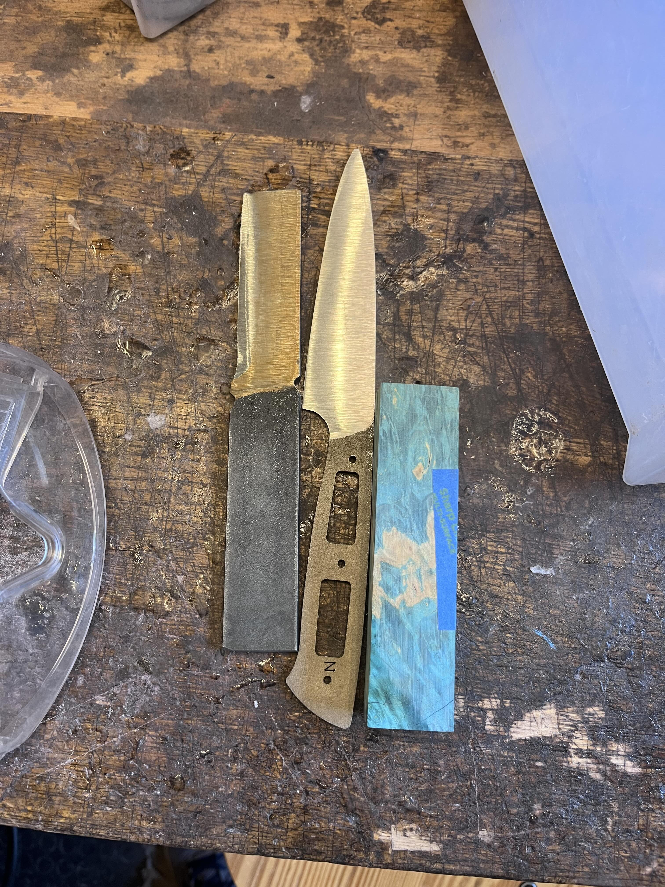

## Initial Work on the Handle

After a quick lunch break, we began working on the handle. First, we roughly
cut the handle's shape and drilled holes for the pins:

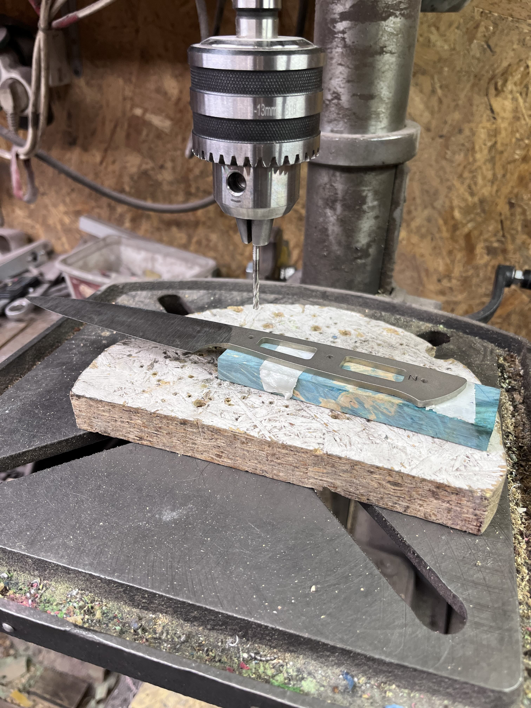

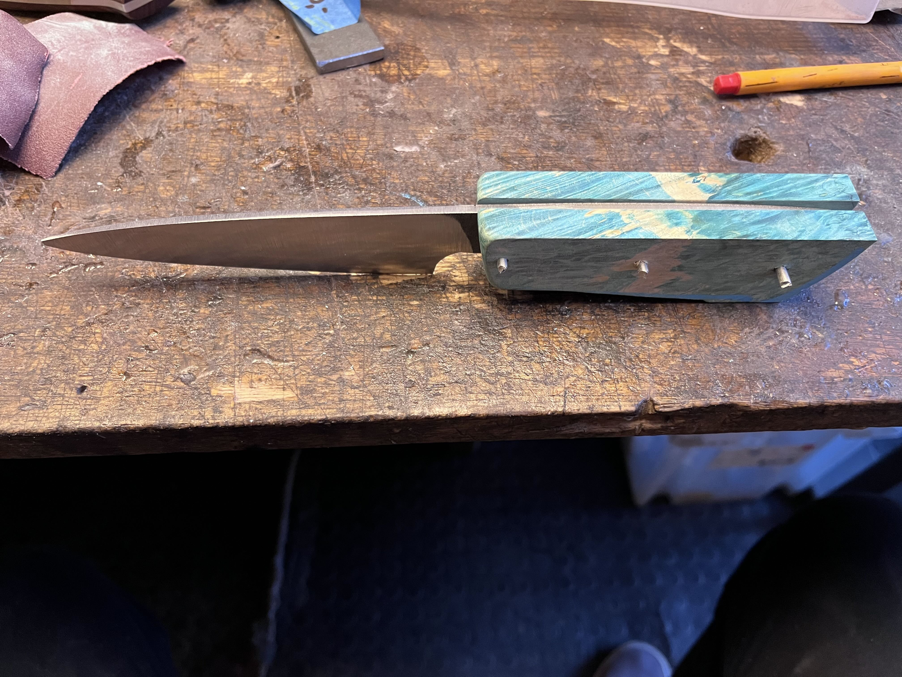

Once the pin holes were drilled and the handle roughly shaped, we worked on the
part of the handle closest to the blade. This involved some grinding with the
belt grinder, hand-sanding with sandpaper, and polishing with a polishing
compound. This step was crucial, as once the handle was glued to the blade,
this area would become almost inaccessible.

The final step of the first day was gluing the handle to the blade.

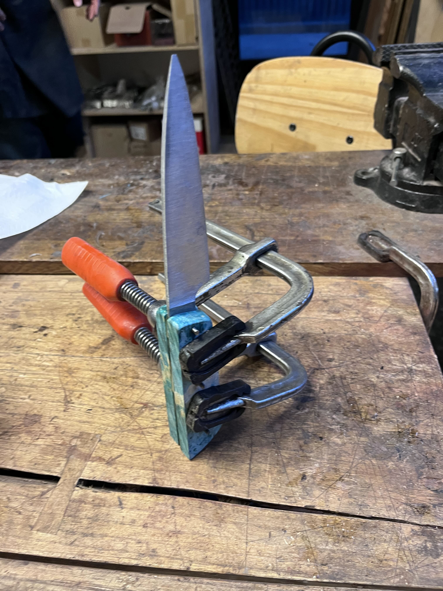

## Day Two

The knives were clamped overnight to ensure the adhesive securely bonded the
blade and handle. The main goal of the second day was to refine the handle's
shape and finish it. The final steps included sharpening the blade tip and
honing the blade.

We started by shaping the handle's profile. Like with the blade, we outlined
the desired shape and used the grinder to remove excess material.

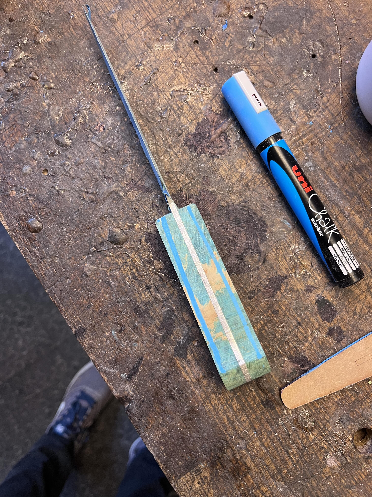

Next, we worked on refining the handle's contours. At this stage, I decided to
make the handle slightly asymmetrical for a more ergonomic fit in my right
hand. This involved using the grinder with various techniques, such as a
loosely tensioned belt or a small cylinder as support.

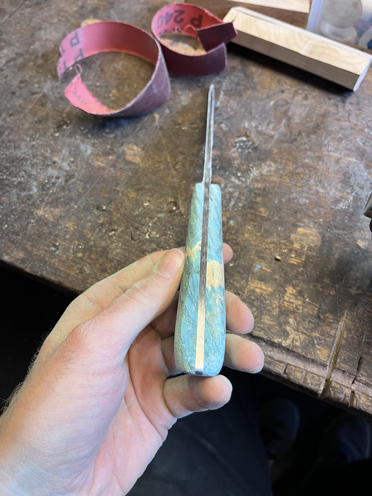

We then sanded the handle with various grades of sandpaper and polished it with
a polishing compound until we achieved the desired finish.

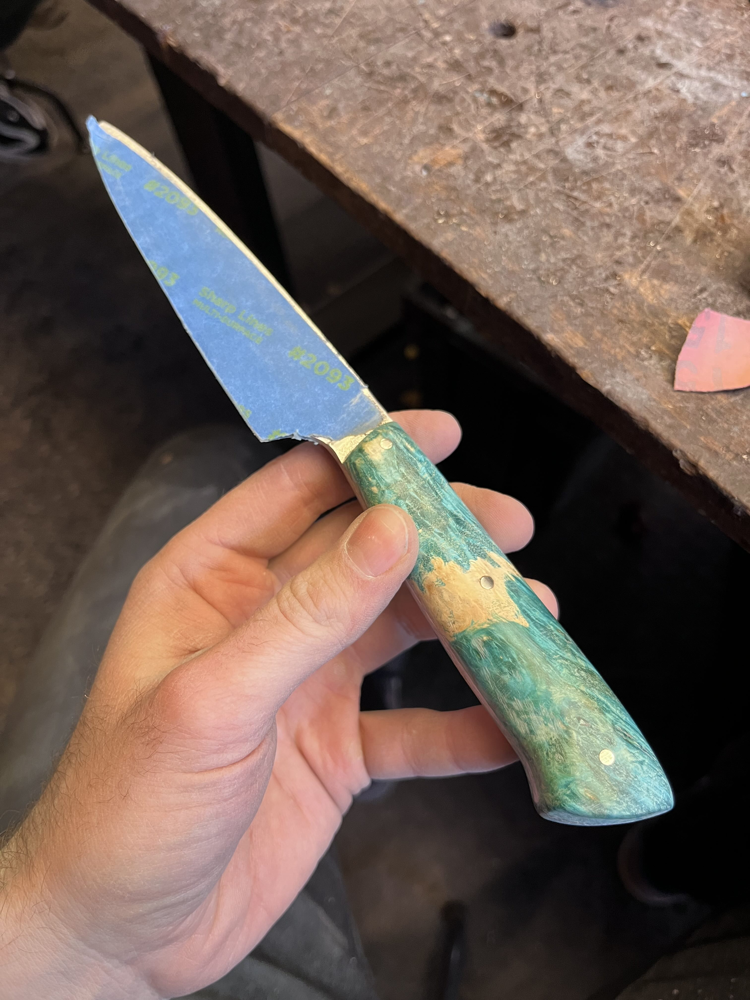

At this point, the handle was complete and was soaked in oil for about half an
hour to enhance the wood's color and protect it.

## Finishing Touches

After the oil bath, the knife was almost ready. We removed the protective tape
from the blade and carefully used the belt grinder to sharpen the blade tip.
This step required extra caution, as the steel at the tip was very thin.

The final step of the workshop was sharpening the blade. At home, I usually
sharpen my knives using Japanese water stones. At the workshop, we used
diamond-coated sharpening stones. This was a new experience for me, and I found
it faster and slightly easier. After about 10 minutes, the knife was sharp and
ready to use.

## Conclusion

The workshop was a very enjoyable and rewarding experience. It was conducted
professionally, and everyone received guidance and support as needed. In total,
it involved over 13 hours of manual work, resulting in a tangible, practical
object tailored to my needs and aesthetically pleasing.

I highly recommend this type of workshop to anyone, even those who might not
initially be interested in knives.

## References

1. [Kłosy](https://klosy.pl/).
