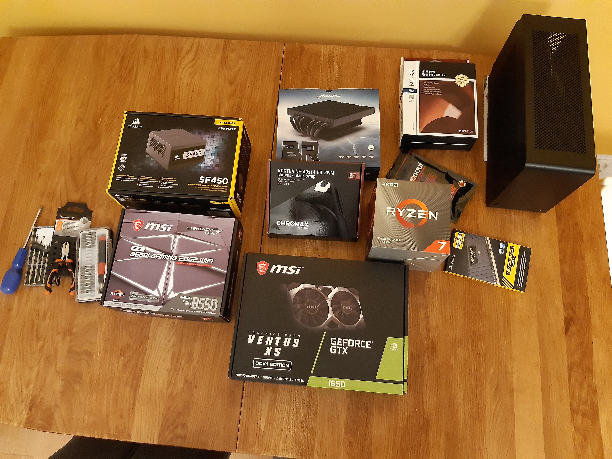
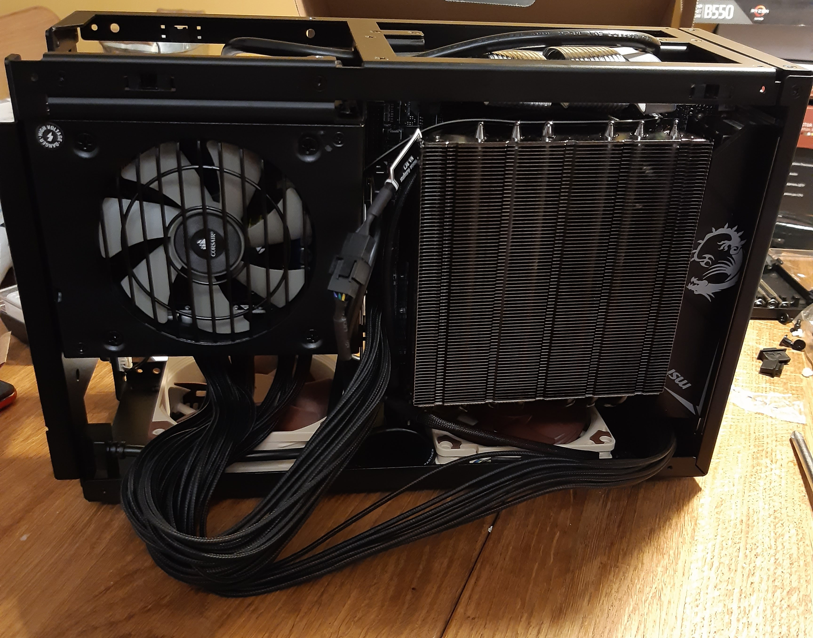

## Intro

At the beginning I want to say, thank you, to
[Tymek](https://github.com/tmakowski) for introducing me into SFF and general
building a PC area. He also gave me a lot of tips and advices which surely
saved me many hours of reading hardware specs.

For last ten years I've been using laptops as my main interface for programming
and browsing Internet. Reason for that was me being a student
for whom battery life and device's weight was more important than better specs.
I needed something mobile. Nowadays I rarely have to use PC outside and when I
do Termux on my phone is usually enough.

Small Form Factor (SFF) PCs are PCs which fits in case of volume smaller than
20 liters. Just a regular PC but put in rather small case. When Tymek told me
about SFF PCs I though it's a great idea and it's time to build my own PC. I've
never even build regular size PC ever before.

## Planning

As it turned out the most difficult part of building small PC is getting a
small case. Usually small cases are produced in batches - there is no serial
production yet. Therefore number of cases and availability are limited.
At first I've selected Cooler Master NR200 case but later on changed my mind to
[Dan A4-SFX](https://www.dan-cases.com/dana4.php). Compact 7.2 liter volume case.
Besides the case most components of SFF PC are fairly regular. CPU, memory,
graphic card and hard drives usually can be regular. Different to
regular PC is smaller motherboard (mini-ITX) and, in case of Dan A4, CPU cooler
have to be thin. Alpenfohn Black Ridge radiator was design primarily for
Dan A4 case so it was a natural choice.

For my build I wanted more than 16 GB of RAM and reasonable fast CPU with more
than four cores. That was my main goals. I really don't care about GPU. I don't
use it very much (I should try C++ CUDA one day though). In this context the
only requirement was to handle 4K display which in 2020 probably every GPU
meets.

## Components

* **Case:** Dan A4-SFX v4.1
* **Motherboard:** MSI MPG B550I Gaming Edge WiFi
* **CPU:** AMD Ryzen 7 3700X, 3.6 GHz, 8 cores
* **RAM:** Corsair Vengeance, 2x16GB, 3000 MHz
* **GPU:** MSI GeForce GTX 1650 VENTUS XS OC, 4 GB
* **SSD:** Samsung 970 EVO Plus, 1 TB, M.2 PCIe
* **SSD2:** Goodram PX400, 256GB, M.2 PCIe
* **Power supply:** Corsair SF, 450W, 80+ Platinum
* **CPU cooler:** Alpenfohn Black Ridge
* **Fan:** Noctua NF-A9x14 PWM, 92mm
* **Fan2:** Noctua NF-A9 PWM, 92mm

For future reference total price was about 6400 PLN which is around $1600 or
1400 EUR (according to actual rates).

## Building

The last component (the case) arrived on September 23rd. When my
almost-two-year-old fall asleep I started assembling my first PC. Just before
that I watched [this](https://www.youtube.com/watch?v=AENfa_nNvuI) video few times.

The first step was to put together components on motherboard. First SDDs, next
CPU and RAM. That was very pleasant. Everything fit nicely. The next step was a
bit more challenging - placing Black Ridge on top of the CPU. Base of this CPU
cooler is screwed directly into motherboard so I had to be very careful.

Next step was putting motherboard into the case. I did it twice because after
the first one I noticed that fan under the motherboard should go first. After
motherboard was steadily screwed in the case I added another fan and power
supply. At this point almost all components was set inside the case. Next I
started to read manuals to properly connect cables to motherboard. As you can
see on the photo above cables from the power supply were a bit too long.
Modelling and zipping took me a while.

Everything to this point took me about 3 hours but now I was ready to plug in
keyboard, monitor and test it! I did and nothing happened. So probably I
messed up cables. As it turned out I plugged power switch into power LED.
Fortunately I could fix that without disassembling the parts. After that fix,
LEDs turned on and fans started. After couple of seconds I saw beautiful MSI
BIOS and I checked that everything is working.

Next morning I finished cable management and I closed the case.

## Final Effect

In my opinion building process went very smooth. Even for someone without any
prior experience in building a PC. On the next day I installed operating system
(Ubuntu 20.04) and I started to set up my environment.
Even in domain of programming I've noticed a huge improvements. Compiling
projects and installing stuff is for sure 10-20x faster than on my laptop.
Everything is so smooth. I'm very satisfied with the result.
Overall experience of building a PC by myself was very pleasant and rewarding.
Probably won't be my last build.

