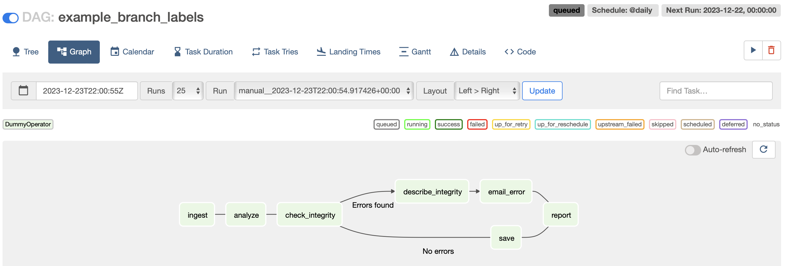

## Intro

I've started implementing yet another DAG scheduler, something like [Airflow](https://airflow.apache.org) or
[Luigi](https://github.com/spotify/luigi). This post is going to be on why I'm doing this and what I'm trying to
achieve.

Before we start, let me do a short introduction to schedulers, in case you've never heard about it or use it yourself.
What in here I'm calling _scheduler_ is a program or software system which is responsible for scheduling execution of
tasks or another programs in particular order. That software can be also responsible for executing tasks, but the
emphasis is placed on scheduling and keeping track of all dependencies, its statuses and so on.

One of the first such programs was [cron](https://man7.org/linux/man-pages/man8/cron.8.html) which is Linux standard
daemon for executing scheduled commands. It basically runs in the background and executes a command or a script at
particular time expressed by [crontab](https://man7.org/linux/man-pages/man5/crontab.5.html) - classic now `0 12 * * *`
format. It is still used nowadays in some cases, because it's already installed on UNIX systems and requires almost no
setup.

Cron is rather simple regarding process definition - it's limited to single command or single script. In most of
modern schedulers a process is expressed using directed acyclic graph (DAG) of tasks. This way we can express patterns
in a process like task `B` can run in parallel to task `A` and task `C` cannot start before `A` and `B` are done. Those
processes usually run on a certain schedule. For example once a day at 8:00AM or each 15 minutes, but no on
weekends. Some of them might have no schedule but are triggered externally.

Where this kind of software is used? From my perspective and best to my knowledge it's mostly used to orchestrate data
processing. Let's consider an example where we need to prepare data for reporting layer. This process requires talking
to many data sources, perhaps migrating data between clouds, then doing transformation and then aggregations on
transformed data. This might be very complex process and it needs to run everyday. In this example our DAG could have
separate tasks for migrating data, another for doing transformation in the database and yet another doing aggregations
and exporting reporting data to external data source. Having scheduler in this example gives us many positive points
such as:

* Process is defined in single place (hopefully via code)
* If anything break, you know exactly what to fix and what can be affected by the failure
* You can resume processing after fixing the bug, because you know where the process stopped and all dependencies are
  contained in the DAG
* Usually you have history of runs for processes with task durations and other statistics, so you can tell if there is
  a slowdown

A DAG of tasks provides the versatility to accurately represent any desired process. It doesn't need to be data
processing. It might be for example setting up an infrastructure or an end-to-end tests environment.

## How it started

In February 2023 I joined Point72 Risk Technology team, to help building new platform for computation and analytics. In
addition to distributed computation functionalities we also needed a scheduler for processes around this new platform.
We didn't want to use our legacy scheduler, because it was embedded in the "old" on-prem infrastructure. We decided to
go with [AWS MWAA](https://docs.aws.amazon.com/mwaa/latest/userguide/what-is-mwaa.html) which is managed version of
Airflow on AWS. At the time I was the only person on the team with actual hands-on experience with Airflow, so it was
my responsibility, to setup infrastructure for MWAA (Terraform), the local development environment, CI/CD processes and
integration with other systems used in our Risk department.

It was my second adventure with Airflow and this time I've had similar reflections. Airflow is very easy to use from
developer view point and has rather good UI, but on the other hand Airflow has poor performance, uses a lot of
resources and is not reliable. I'll probably talk more about downsides of Airflow another time.

At this point I thought that I really like high-level idea of a scheduler and I'd like to have improved version of
Airflow. Something that is flexible enough (cannot be more flexible then Python though), has very good performance and
is reliable and scalable. Also something that's easy to use locally or in simplified setup and at the same time can be
deployed in the cloud or/and using Kubernetes. Around the second half of August 2023 I started my vacation and also I
started thinking about high level architecture for a new scheduler written in Go and sketching implementation starting
from small problems like [Getting method's source code in Go](https://dskrzypiec.dev/go-ast/).

## Why new scheduler?

All schedulers I've seen or used can be categorized to at least one of the following groups. Is written in Python, is
low-code or no-code where processes aren't defined as code or is proprietary with limited control. We have already
mentioned Python examples - Airflow and Luigi. With this group, my main problems are safety, maintainability and
performance. Example for low-code or no-code can be [Azure Data
Factory](https://azure.microsoft.com/en-us/products/data-factory). It might be a good choice for some teams but in my
opinion it's much better investment to have processes defined as a code in almost every case. It makes testing,
refactoring and migrations possible with much less effort.

Is it a good idea to pick language other than Python to write a scheduler when most of data engineering and data
science stacks are based on Python? Yes, I think so. At least that's my opinion. I think in many cases Python doesn't
pull its weight. Maintaining Python dependencies, over provisioning infrastructure to make it barely run and living
without almost any assurance from type system or compilation usually doesn't justify advantage that Python is simple
and we can swiftly write a lot of code.

Another very important point for me is the fact that in this case I have sort of clear vision how my scheduler will
look like. It's my first side project that I'm working on for longer then a month (it's already four months). I feel
it's good to have long term personal project to think about and work on. Even if everything I said in the previous
paragraphs is nonsense I'd still do it because of this single reason. I want to implement something that I'd love to
use daily and something I can trust. It doesn't need to be implemented by myself, so I can trust it, but at least it
should behave as expected in most cases. Even if I'll be the only user, I think it's still worth it!

## What is my plan?

I started with regular Go project which had few packages and could built two binaries - scheduler and executor. Then I
realized that those binaries are very thin wrappers for functionalities from those packages, so I asked myself is it
possible to expose scheduler and executor just as regular Go packages? I think it's possible and that's what I'm
working on currently.

However, those packages shouldn't be the end product. Even though packages won't be the only outcome of this
project, making it public pushes me to write better documentation, prepare examples and think extra carefully about the
API. All of the above are great things. In case when those packages would be private it's still desired to put effort
in those aspects. To give a little bit of help to my strong will, deciding to make those packages public and
treating them as intermediate artifacts should have a positive impact on the project overall.

I don't really have very detailed plan. There's a lot of work to be done, but I'm trying to do something along those
lines

1. Finish implementation and testing of scheduler and executor packages.
1. Make it trivial to develop and run locally in simplified form (scheduler and executor in single binary + SQLite)
1. Design UX for core functionalities.
1. Implement first draft of the UI.
1. Prepare Kubernetes deployment or something similar, to make it possible to deploy scheduler + N executors on
   separate nodes.
1. Setup separate and proper website for documentation, examples, tutorials and other related stuff.
1. ???
1. Profit.

## Details?

Even though I have figured out high level architecture and few other details, I don't really want to say it publicly
just yet. I think it might be too soon. I don't even have a name for this project yet. I'll definitely post more
details on this project in the future!

## Summary

Yep, so because of this I haven't posted anything in last couple of months. Most of my spare time, besides family time
and running I was spending working on this project. It's roughly 9k lines of Go including 4.5k lines of tests at the
moment. I hope to keep working on this, to create something you would be excited to use in production environments.

