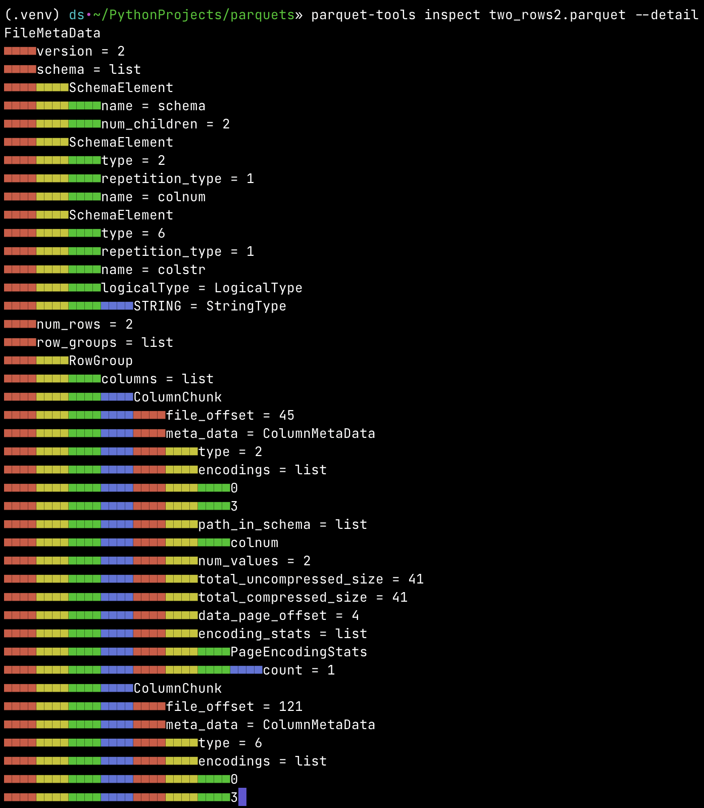
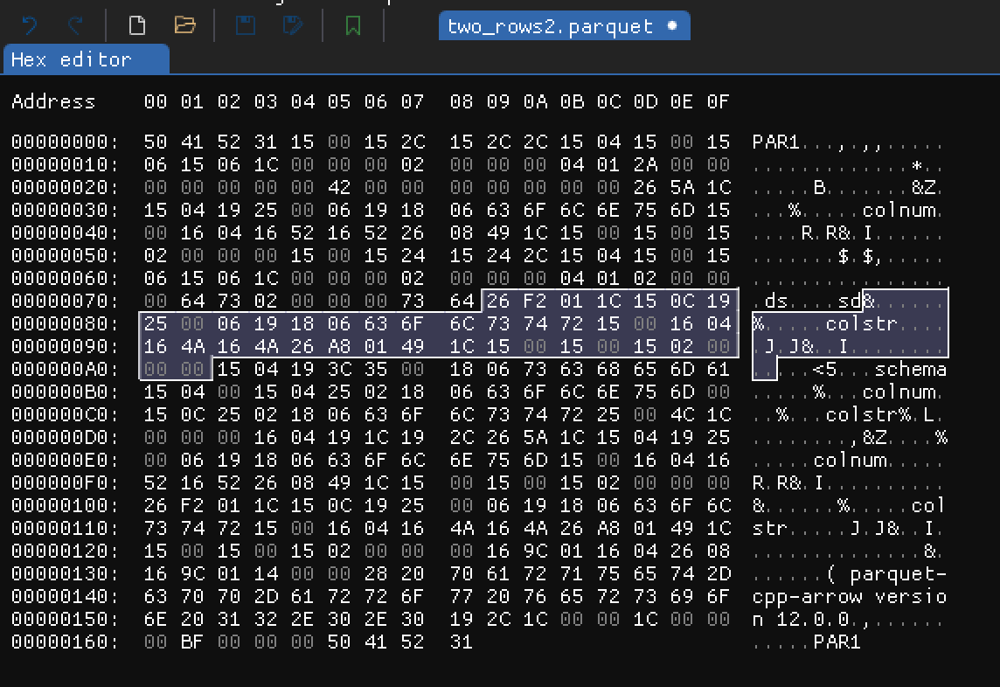

## Intro

Recently I've visited [very interesting website](https://subtls.pages.dev) which presents byte by byte what happens
when website (data) is sent using TLS. One thing is to know roughly how TLS works and another one is to actually see
with explanations what is really happening. Under its influence I thought that I've been working with parquet files for
some time but I don't really know their structure. I know its properties, how and when one should use it but I have
never really experienced what parquet format really is.

In this blog post I'll present my findings on the way to understand and **see** parquet files structure.


## Typical overview of parquet format

The [Apache Parquet](https://parquet.apache.org) file format is a binary and columnar storage file format mostly used
for tabular data in big data processing. It was initially designed as file format for the [Apache
Hadoop](https://hadoop.apache.org) which was one of the first open-source "big data" technologies for distributed
computation.

Parquet file format has the following characteristics:

1. It's binary format. Not really human readable. That's a contrast for example to JSON which is always in human
   readable format.
1. It's column-oriented (or columnar) format. That means data is stored column-by-column rather than row-by-row.
1. Supports schema evolution. That means we can add or change columns in the table without rewriting existing data.
1. Supports data compression and encoding on various levels.
1. It's "write-once read-many" type of format. That in particular means one cannot really update data in existing
   parquet file. In this case the file needs to be regenerated.
1. It stores metadata. Including table schema, row groups and columns metadata.

This file format was meant to be used for data processing and analytical purposes. It's optimized for that. It's
usually used as input, output or intermediate step in data pipelines or as the source for analytical layer tools.

That was more or less what I've known about parquets before starting working on this blog post. Let's dive deeper.


## Simple example

I figured the simplest way to analyze parquet structure is to start from generating very simple and concrete parquet
file and then somehow analyze it. Let's start from generating parquet file representing the following table


|   colnum | colstr   |
|----------|----------|
|       42 | ds       |
|       66 | sd       |

It can be done using `pyarrow.parquet` module in Python:

```
import pandas as pd
import pyarrow as pa
import pyarrow.parquet as pq

df = pd.DataFrame({
    "colnum": [42, 66],
    "colstr": ["ds", "sd"]
})

table = pa.Table.from_pandas(df)
pq.write_table(table, "two_rows.parquet")
```

To my surprise the output parquet file `two_rows.parquet` weighted **2243** bytes. What? Two integers, two very
small strings and possibly metadata about two columns needed over 2kb of data in parquet file? Then I thought that
parquet format is probably more complicated then I expected. We will get there.

To make this example simpler I went through
[pyarrow.parquet.write_table](https://arrow.apache.org/docs/python/generated/pyarrow.parquet.write_table.html) function
documentation and was able to tweak parameters a bit, like this:

```
pq.write_table(
    table,
    file_name,
    row_group_size=1000,
    use_dictionary=False,
    compression="NONE",
    write_statistics=False,
    column_encoding="PLAIN",
    store_schema=False
)
```

So, as you can see, we don't use compression, we use plain text encoding, don't store schema and statistics. All that
simplified output parquet files from 2243 bytes to **361** bytes. That sounds much better. One could argue that we are
going to analyze only the simplest version of parquet format and that's true but I need to start somewhere. I got a
feeling that I can try to analyze it and understand it, even if I need to go through every byte. Let's see those
bytes without knowing much about its structure yet. Using `xxd file_name.parquet` we got hexadecimal dump:


```
5041 5231 1500 152c 152c 2c15 0415 0015  PAR1...,.,,.....
0615 061c 0000 0002 0000 0004 012a 0000  .............*..
0000 0000 0042 0000 0000 0000 0026 5a1c  .....B.......&Z.
1504 1925 0006 1918 0663 6f6c 6e75 6d15  ...%.....colnum.
0016 0416 5216 5226 0849 1c15 0015 0015  ....R.R&.I......
0200 0000 1500 1524 1524 2c15 0415 0015  .......$.$,.....
0615 061c 0000 0002 0000 0004 0102 0000  ................
0064 7302 0000 0073 6426 f201 1c15 0c19  .ds....sd&......
2500 0619 1806 636f 6c73 7472 1500 1604  %.....colstr....
164a 164a 26a8 0149 1c15 0015 0015 0200  .J.J&..I........
0000 1504 193c 3500 1806 7363 6865 6d61  .....<5...schema
1504 0015 0425 0218 0663 6f6c 6e75 6d00  .....%...colnum.
150c 2502 1806 636f 6c73 7472 2500 4c1c  ..%...colstr%.L.
0000 0016 0419 1c19 2c26 5a1c 1504 1925  ........,&Z....%
0006 1918 0663 6f6c 6e75 6d15 0016 0416  .....colnum.....
5216 5226 0849 1c15 0015 0015 0200 0000  R.R&.I..........
26f2 011c 150c 1925 0006 1918 0663 6f6c  &......%.....col
7374 7215 0016 0416 4a16 4a26 a801 491c  str.....J.J&..I.
1500 1500 1502 0000 0016 9c01 1604 2608  ..............&.
169c 0114 0000 2820 7061 7271 7565 742d  ......( parquet-
6370 702d 6172 726f 7720 7665 7273 696f  cpp-arrow versio
6e20 3132 2e30 2e30 192c 1c00 001c 0000  n 12.0.0.,......
00bf 0000 0050 4152 31                   .....PAR1
```

We already can see `colnum`, `colstr` column names and `ds` and `sd` string values. That's good. Now I think we are
ready to explore the hex dump further with a help from [parquet file format
documentation](https://github.com/apache/parquet-format).


## File format

As we can read in [high level parquet file format](https://github.com/apache/parquet-format#file-format) parquet file
is composed of pairs column data and its metadata grouped into group rows. At the end there is file metadata and its
size expressed in 4-byte length. The first and last bytes in the file are magic bytes "PAR1" (in hex `5231`).

In our simplified example where we have only 2 rows (single row group) the high level format structure is of the form:


```
4-byte magic number "PAR1"
<Column 1 + Column Metadata>
<Column 2 + Column Metadata>
File Metadata
4-byte length in bytes of file metadata (little endian)
4-byte magic number "PAR1"
```

In more general case parquet file is composed of possibly many row groups. Within each row groups there are columns
which are split into pages. Metadata is included on each level, but most importantly in the file footer there is
`FileMetaData` which keeps information about all row groups, column chunks and data pages. All metadata is encoded
using Thrift format and definition for parquet might be found
[here](https://github.com/apache/parquet-format/blob/master/src/main/thrift/parquet.thrift).

Before we jump into reading and analyzing hex dump let's me briefly mention a very helpful tool in context of parquet
files - [parquet-tools](https://pypi.org/project/parquet-tools/).

## parquet-tools

It's a tool for reading data from parquet files and inspecting its schema using command line interface. The simplest
use is calling "show" command

```
parquet-tools show two_rows2.parquet

+----------+----------+
|   colnum | colstr   |
|----------+----------|
|       42 | ds       |
|       66 | sd       |
+----------+----------+
```

To check the schema and metadata of given parquet file we can use "inspect" command. In our simple example those looks
as follows:

```
parquet-tools inspect two_rows2.parquet

############ file meta data ############
created_by: parquet-cpp-arrow version 12.0.0
num_columns: 2
num_rows: 2
num_row_groups: 1
format_version: 2.6
serialized_size: 191


############ Columns ############
colnum
colstr

############ Column(colnum) ############
name: colnum
path: colnum
max_definition_level: 1
max_repetition_level: 0
physical_type: INT64
logical_type: None
converted_type (legacy): NONE
compression: UNCOMPRESSED (space_saved: 0%)

############ Column(colstr) ############
name: colstr
path: colstr
max_definition_level: 1
max_repetition_level: 0
physical_type: BYTE_ARRAY
logical_type: String
converted_type (legacy): UTF8
compression: UNCOMPRESSED (space_saved: 0%)

```

That's very useful! In particular we can see that our very small number are stored as `INT64`. That will be handy when
we start analyzing bytes.

We can even got more detailed information about metadata when we use `--detail` flag for "inspect" command. Result is
presented in very visual-appealing way:




## So far, so good

At this point we learned about parquet file format on the high level. We saw raw hex dump of very simple parquet file.
We saw details of schema and metadata of our simple example. I almost want to say that this is enough to understand
the parquet format. For most programmers and data engineers that for sure would be sufficient. I want to go deeper but
at the same time I hesitated for a moment thinking "we are not meant to read binary". That's probably true. But we are
very close to do so. We probably won't be any closer in the future. Let's do it, as an exercise and as an rare
experience. It's like writing sorting algorithm. You need to do it at least once (for learning), but then never do it
in actual commercial work (except very few cases).

Buckle up, we are going to stare into raw bytes in hexadecimal form. We are going to try make sens out of it with the
help of what we already have learned so far.


## Binary


### Columns data

The easiest part to start with is column values. We know what values to expect and of what type. Let's start from
`colnum` column values. In our input table this columns have two values `42` and `66` which in hexadecimal
representation are `hex(42) = 2a` and `hex(66) = 42`. We also have seen that according to the parquet-tools this column
is of type `INT64` which is 64 bit (8 byte) integer. Given this we can easily spot where in the binary dump this column
is placed


```
(second and third rows of original hex dump)
0615 061c 0000 0002 0000 0004 012a 0000  .............*..
0000 0000 0042 0000 0000 0000 0026 5a1c  .....B.......&Z.
...
```

As you can see we have `2a 00 00 00 00 00 00 00` which is 42 in decimal stored as 64 bit integer. Seven out of eight
bytes are zero and it's enough for one byte to store value 42. Similarly we can see sequence `42 00 00 00 00 00 00 00`
which is decimal value 66 stored as 64 bit integer.


We can also easily spot `colstr` column values. As we already known `colstr` is of type string encoded using
`UTF-8`.

```
(from row 7 to 9 of original hex dump)
0615 061c 0000 0002 0000 0004 0102 0000  ................
0064 7302 0000 0073 6426 f201 1c15 0c19  .ds....sd&......
2500 0619 1806 636f 6c73 7472 1500 1604  %.....colstr....
```

Here we can see sequence `02 00 00 00` and after it we have `64 73` which means `d` and `s` in UTF-8. Next we once
again have `02 00 00 00` and `73 64` so `s` and `d` letters in this case. What's `02 00 00 00`? In UTF-8 `0x02` is
[Start of Text](https://www.compart.com/en/unicode/U+0002) character. Why it uses 4 bytes for this sign? That's
probably because some characters in UTF-8 needs 4 bytes and we want to represent this "special" character in uniquely.

What's important we can clearly see that values from one column are kept in sequence (within one rows group), close together.
As Apache Parquet file format specified.


### File metadata


We already stated that before last 4 magic bytes there are 4 bytes which presents length of file metadata in bytes. In
our case it is `hex(BF) = 191` bytes. In this very simple example 191 out of 361 bytes are just file metadata. Which
makes sense, because we only store actually two rows and two columns of data.

At first I even tried to analyze this raw bytes of file metadata but I very quickly noticed it would be very hard task
to do, due to complex behaviour of the file format. Precise definition of parquet metadata format is specified by
[parquet.thrift](https://github.com/apache/parquet-format/blob/master/src/main/thrift/parquet.thrift) which is Apache
way to define and operate on binary protocols. As we can see this file is over 1000 lines long. There are many optional
parameters and hierarchy of metadata. I still wanted to grasp what those bytes presents, so I tried using Thrift and
mention specification to decode file metadata for our example.

#### Decoding file metadata

Almost surely file metadata will be the same as those obtained from `parquet-tools` presented earlier. But I want to
make sure that decoding those 191 bytes according to Parquet Thrift specification would actually gave the same result.

I started by installing Apache Thrift and Python package `thrift`. Then I downloaded mentioned `parquet.thrift` file
and generated Python module with Python classes and definitions regarding this specification using

```
thrift --gen py parquet.thrift
```

It generated the following Python package

```
/Users/ds/PythonProjects/parquets/genpy
├── __init__.py
└── parquet
    ├── __init__.py
    ├── constants.py
    └── ttypes.py
```

Now we can use it to decode file metadata bytes into actual `FileMetadata` object using the following Python script

```
import struct
from thrift.protocol import TCompactProtocol
from thrift.transport import TTransport
from genpy.parquet.ttypes import FileMetaData

def read_parquet_footer(file):
    # Read the footer length based on last 8 bytes
    file.seek(-8, 2)
    footer_length = struct.unpack("<i", file.read(4))[0]

    # Read the footer content
    file.seek(-(8 + footer_length), 2)
    footer_bytes = file.read(footer_length)
    return footer_bytes

def decode_parquet_metadata(file_path: str) -> FileMetaData:
    with open(file_path, "rb") as file:
        footer_bytes = read_parquet_footer(file)
        transport = TTransport.TMemoryBuffer(footer_bytes)
        protocol = TCompactProtocol.TCompactProtocol(transport)
        metadata = FileMetaData()
        metadata.read(protocol)
        return metadata

def main() -> None:
    metadata = decode_parquet_metadata("two_rows2.parquet")
    print(metadata)

if __name__ == '__main__':
    main()
```

Running this script will read bytes from the footer (selected on the image above) of `two_rows2.parquet` file, decode
it to `FileMetaData` object and print it.


```
FileMetaData(
    version=2,
    schema=[
        SchemaElement(
            type=None, type_length=None, repetition_type=0, name='schema', num_children=2,
            converted_type=None, scale=None, precision=None, field_id=None,
            logicalType=None
        ),
        SchemaElement(
            type=2, type_length=None, repetition_type=1, name='colnum', num_children=None,
            converted_type=None, scale=None, precision=None, field_id=None, logicalType=None
        ),
        SchemaElement(
            type=6, type_length=None, repetition_type=1, name='colstr', num_children=None,
            converted_type=0, scale=None, precision=None, field_id=None,
            logicalType=LogicalType(
                STRING=StringType(), MAP=None, LIST=None, ENUM=None, DECIMAL=None, DATE=None, TIME=None,
                TIMESTAMP=None, INTEGER=None, UNKNOWN=None, JSON=None, BSON=None, UUID=None
            )
        )
    ],
    num_rows=2,
    row_groups=[
        RowGroup(
            columns=[
                ColumnChunk(
                    file_path=None,
                    file_offset=45,
                    meta_data=ColumnMetaData(
                        type=2, encodings=[0, 3],
                        path_in_schema=['colnum'], codec=0, num_values=2, total_uncompressed_size=41,
                        total_compressed_size=41, key_value_metadata=None, data_page_offset=4,
                        index_page_offset=None, dictionary_page_offset=None, statistics=None,
                        encoding_stats=[PageEncodingStats(page_type=0, encoding=0, count=1)],
                        bloom_filter_offset=None, bloom_filter_length=None
                    ),
                    offset_index_offset=None, offset_index_length=None, column_index_offset=None,
                    column_index_length=None, crypto_metadata=None, encrypted_column_metadata=None
                ),
                ColumnChunk(
                    file_path=None,
                    file_offset=121,
                    meta_data=ColumnMetaData(
                        type=6, encodings=[0, 3],
                        path_in_schema=['colstr'], codec=0, num_values=2, total_uncompressed_size=37,
                        total_compressed_size=37, key_value_metadata=None, data_page_offset=84,
                        index_page_offset=None, dictionary_page_offset=None, statistics=None,
                        encoding_stats=[PageEncodingStats(page_type=0, encoding=0, count=1)],
                        bloom_filter_offset=None, bloom_filter_length=None
                    ),
                    offset_index_offset=None, offset_index_length=None, column_index_offset=None,
                    column_index_length=None, crypto_metadata=None, encrypted_column_metadata=None
                )
            ],
            total_byte_size=78, num_rows=2, sorting_columns=None, file_offset=4, total_compressed_size=78, ordinal=0
        )
    ],
    key_value_metadata=None, created_by='parquet-cpp-arrow version 12.0.0',
    column_orders=[
        ColumnOrder(TYPE_ORDER=TypeDefinedOrder()), ColumnOrder(TYPE_ORDER=TypeDefinedOrder())
    ],
    encryption_algorithm=None, footer_signing_key_metadata=None
)
```

That's almost insane how complicated is the structure of parquet `FileMetaData`. Let's keep in mind that our
`two_rows2.parquet` has simplified format and that's why most on metadata is `None`. After reading Thrift specification
file and seeing this output for the first time I thought it would be silly to try decoding those bytes manually.

There are lot of interesting information in `FileMetaData`. In general it's recommended to read this metadata first and
then based on this reach for the data - particular column (`ColumnChunk`). For instance we have

* `file_offset` in `ColumnChunk` which represents byte offset from the beginning of the file to this column metadata
* `data_page_offset` in `ColumnMetaData` which represents byte offset from the beginning of the file to first data page
* numer of rows for given column
* size (compressed and uncompressed) of column metadata
* information about encoding


### Columns metadata and other parts

There are few chunks of bytes we haven't yet described. Two of those chunks are placed just after column values data. According to
Parquet high level structure it suppose to be corresponding column metadata.


* Metadata for column `colnum`:
    

* Metadata for column `colstr`:
    


I won't go into details here. Column metadata in `ColumnChunk` contain information we already saw in `FileMetaData`.
It's additionally store there, because we might want to read or analyze columns in isolation. There are few bytes which
express `RowGroup`, `PageHeader` and `DataPageHeader` which are parts of high level parquet format. This is important
when we have much bigger files and data is split across many row groups and pages. In our example there is just single
row group and single page of data.


## Summary

I definitely deepened my knowledge about Apache Parquet file format while working on this post. I didn't expect this to
be such complex file format. I haven't analyzed every single byte in our basic example but nevertheless I learned and
**saw** how data is structured and what is the format of metadata. I feel I overcome, even if not fully, the
boundary of binary file format and actually read it. I hope readers of this blog post will have at least glimpse of
internals of Apache Parquet file format.


## References


1. [Apache Parquet](https://parquet.apache.org)
1. [parquet.thrift](https://github.com/apache/parquet-format/blob/master/src/main/thrift/parquet.thrift)
1. [Scripts for this post](https://github.com/DSkrzypiec/blogSourceCodes/tree/master/20230609_Parquet)
1. Images with hex dumps were took from hex editor [ImHex](https://github.com/WerWolv/ImHex)
