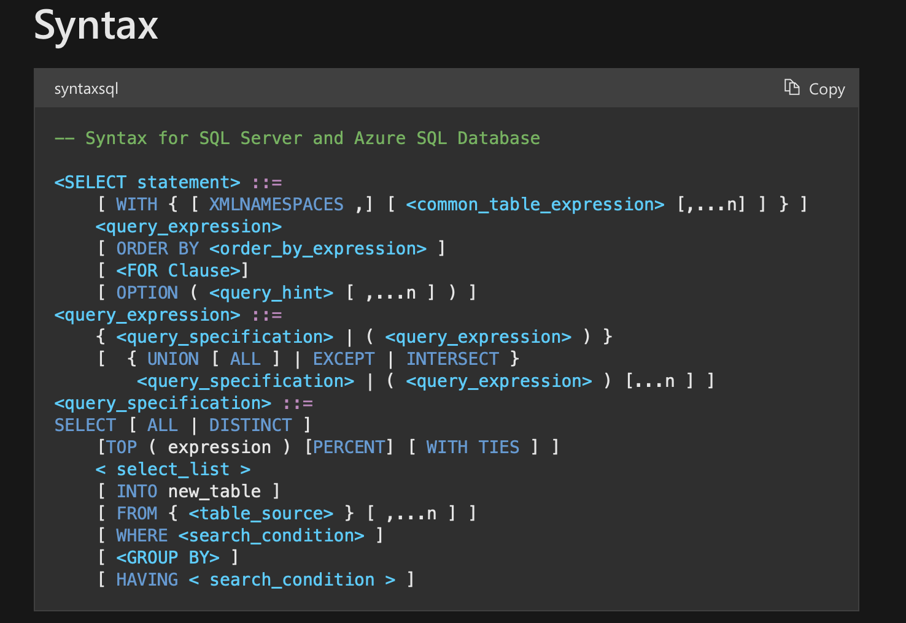

## Intro

Once I've tried to implement auto formatter for T-SQL. To make this there seems to
be two ways. The first and easier one is to implement sets of rules to
transform text file without any context. The other one is to base on
[AST](https://en.wikipedia.org/wiki/Abstract_syntax_tree) of T-SQL and use its
context to apply formatting. The first case seems to be easier at the beginning
and can be gradually extended but it's really hard and dirty to include all of
the cases without the knowledge of the context. So I thought the right way is
to use abstract syntax tree.


## Implementing a parser

Roughly about two years ago I couldn't find a library containing lexer and
parser for T-SQL so I've chosen to write my own parser of T-SQL. By the way, I
haven't really write a parser ever before so I treated it as a nice opportunity
to learn.

The whole idea of creating code auto formatter came from Go language with such
a tool. Obviously I looked into implementation of [Go's
parser](https://github.com/golang/go/blob/master/src/go/parser/parser.go).

I very liked this implementation, clean and simple. In similar way I've
implemented a lexer (scanner) and started to implement a parser.
I've wrapped around implementation of core mechanism but I didn't have enough
motivation and time to implement fully-fledge parser for T-SQL. It has stalled and
I have leaved the project behind.


## Oh, there is a library

Very recently I've discovered
[Microsoft.SqlServer.TransactSql.ScriptDom](https://docs.microsoft.com/en-us/dotnet/api/microsoft.sqlserver.transactsql.scriptdom?view=sql-dacfx-150)
library. Unfortunately it is no __yet__ open source (on the publishing date)
according to [this
discussion](https://github.com/microsoft/sqltoolsservice/issues/973). You can
find a NuGet package
[here](https://www.nuget.org/packages/Microsoft.SqlServer.TransactSql.ScriptDom).

The library contains functionality for parsing, transforming and generating AST
of T-SQL. That sounds great. How come I haven't found it back 2 years ago? In
my opinion it is not easy to find. It might be a bit easier after 2020 when
[this blog post](https://devblogs.microsoft.com/azure-sql/programmatically-parsing-transact-sql-t-sql-with-the-scriptdom-parser)
was written.

The API of the library is pretty convenient. The basic example of use to get an
AST based on given SQL script path goes as follows

```
using (TextReader str = new StreamReader(sqlFilePath)) {
    var parser = new TSql150Parser(true, SqlEngineType.All);
    var tree = parser.Parse(str, out var errors);
    ...
}
```

An AST is in form of `TSqlFragment`. In order to traverse the parsed AST 
[visitor pattern](https://en.wikipedia.org/wiki/Visitor_pattern) can be used
via `TSqlFragment.Accept` method. In order to do that one have to implement a
class which inherits from `TSqlFragmentVisitor`. It has many overloads (2005 in
total) for `ExplicitVisit` and `Visit` methods for different nodes of AST.


```
public abstract class TSqlFragmentVisitor
{
    protected TSqlFragmentVisitor();

    public virtual void ExplicitVisit(FederationScheme node);
    public virtual void ExplicitVisit(CreateTableStatement node);
    public virtual void ExplicitVisit(ConstraintDefinition node);
    public virtual void ExplicitVisit(ColumnStorageOptions node);
    ... // 2005 overloads for two different methods of different type of nodes
    public virtual void Visit(ExecuteInsertSource node);
    public virtual void Visit(AlterDatabaseAddFileGroupStatement node);
}
```

As example let's take a look for visitor which finds all `DROP TABLE`
statements and prints a warning. In this case `MyVisitor` would looks like the
following

```
public class MyVisitor : TSqlFragmentVisitor {
    public override void ExplicitVisit(DropTableStatement stm) {
        var objects = stm.Objects;
        if (objects.Count > 0) {
            foreach (var obj in objects) {
                var msg = $"You try to DROP {obj.BaseIdentifier.Value} " +
                    $"in line: {obj.StartLine} col: {obj.StartColumn}";
                Console.WriteLine(msg);
            }
        }
        base.ExplicitVisit(stm);
    }
}
```

Finally it can be applied via `Accept` method.


```
using (TextReader str = new StreamReader(sqlFilePath)) {
    var parser = new TSql150Parser(true, SqlEngineType.All);
    var tree = parser.Parse(str, out var errors);
    tree.Accept(new MyVisitor());
}
```

Full running example can be found
[here](https://github.com/DSkrzypiec/blogSourceCodes/tree/master/202111_ParsingTSQL/sqlParser).

Another simple and really easy example of using T-SQL parser is
[this example](https://michaeljswart.com/2014/04/removing-comments-from-sql)
for removing all comments from T-SQL script.


## ANTLR

[ANTLR](https://www.antlr.org) is a tool for generating parsers. As it turned
out there is already open source, community-built, grammar for T-SQL. Definition
can be found [here](https://github.com/antlr/grammars-v4/tree/master/sql/tsql).

Based on this grammar definition ANTLR would generate a lexer, parser and
listeners in a target language. Supported target languages for ANTLR4 are Java
(ANTLR is written in Java), C#, Python, JavaScript, Go, C++, Swift, PHP and
Dart.

I wanted to try it mostly because it's open source and I browse through the
grammar and make some changes (improvements). Another reason is that if this
would went smooth I could write up a grammar for
[Snowflake SQL](https://docs.snowflake.com/en/) which I use at work recently.

I've copied `TSqlLexer.g4` and `TSqlParser.g4` files and use ANTLR4 to generate
set of C# classes using the following command (assuming you have ANTLR4
installed)

```
antlr4 -Dlanguage=CSharp TSqlLexer.g4 TSqlParser.g4 -o tmp
```

It has generated the following files in the `tmp` catalog

- `TSqlLexer.cs` - a file with `TSqlLexer` class definition in 9775 lines of code
- `TSqlParser.cs` - a file with `TSqlParser` class definition in 130774 lines of code
- `TSqlParserListener.cs` - a file with `TSqlParserListener` class definition in 5787 lines of code
- `TSqlParserBaseListener.cs` - a file with `TSqlParserBaseListener` class definition in 6943 lines of code.

`TSqlParserBaseListener` fill empty implementations of `TSqlParserListener` abstract methods.

In order to actually use those generated C# classes in your project you need
one more thing -
[Antlr.Runtime](https://www.nuget.org/packages/Antlr4.Runtime.Standard) library.


The basic example of using this ANTLR4-generated parser can looks like this

```
using (TextReader str = new StreamReader(sqlFilePath)) {
    var lexer = new TSqlLexer(new AntlrInputStream(str));
    var tokenStream = new CommonTokenStream(lexer);
    var parser = new TSqlParser(tokenStream);
    var tree = parser.tsql_file();
    ...
}
```

In order to write up a listener for an AST you have to implement a class which
inherits by `TSqlParserBaseListener` like this

```
public class MyParserListener : TSqlParserBaseListener {
    public override void ExitDrop_table(TSqlParser.Drop_tableContext context) {
        var idNames = context
                        .table_name()
                        .id_()
                        .Select(e => e.GetText());
        var msg = $"You're trying to delete {string.Join(".", idNames)}";
        Console.WriteLine(msg);
    }
}
```

Once you've got it you can apply it using `ParserTreeWalker`

```
...
var ml = new MyParserListener();
ParseTreeWalker.Default.Walk(ml, tree);
```

The full running example can be found
[here](https://github.com/DSkrzypiec/blogSourceCodes/tree/master/202111_ParsingTSQL/antlrTsqlParser).


I should add that there is no guarantee for the correctness of this unofficial
T-SQL grammar. Even in case of `DROP TABLE` statement which I've presented here
there is a difference with actual SQL Server specs.
It suppose to be

```
DROP TABLE [ IF EXISTS ] { full_name | schema.table | table } [ ,...n ]
[ ; ]
```

which means that there might be many tables listed after `DROP TABLE` keywords
seperated by comma but in the open source version there is only single table
allowed:

```
drop_table
    : DROP TABLE (IF EXISTS)? table_name ';'?
    ;
```

## Summary

In my opinion having a parser for query (and other) languages might be an
extremly useful tool, especially if you're a data engineer. Based on AST you
can implement static analyzers, verifiers, validators, fixers and others.

In term of T-SQL I'd go with official Microsoft library. On the other hand if
there is no official parser it would be much easier to define a grammer and
generate parser with ANTLR than writing a parser from scratch.

I'll defenetly play around with ANTLR, probably with Snowflake SQL for which I
didn't find defined grammer. It also might be a very good excercise to go
through the whole documentation.


## References

1. [github.com/DSkrzypiec/mssfmt](https://github.com/DSkrzypiec/mssfmt)
2. [Microsoft SQL Server Script DOM](https://www.dbdelta.com/microsoft-sql-server-script-dom/)
3. [Another Microsoft blog post](https://devblogs.microsoft.com/azure-sql/programmatically-parsing-transact-sql-t-sql-with-the-scriptdom-parser/)
4. [Getting started with ANTLR in C#](https://tomassetti.me/getting-started-with-antlr-in-csharp)

