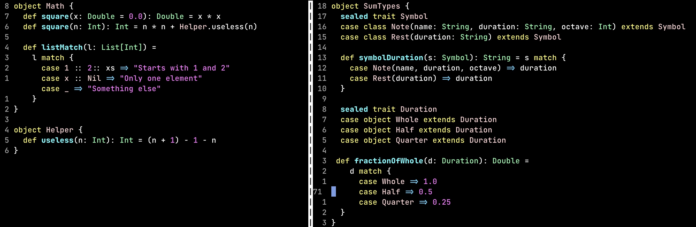

## Intro

This post is about my first thoughts on Scala programming language. There is a
great chance that I'll be using Scala in the upcoming months, so I've read
[Programming in Scala](https://www.artima.com/shop/programming_in_scala_5ed)
in the last couple of days. Besides reading a book I also watched a bunch
presentations and tutorials on YouTube and write few simple programs as
an exercise.

Scala is the most similar to F# from all programming languages I know.
Therefore there will be few comparisons to F# and few general thoughts.

As I said those are my first thoughts. Please keep this in mind. It might
turned out that I've misunderstood some concepts or I'll change my mind after
writing a bit more code using Scala.


## Syntax

Scala syntax is concise in comparison to Java or C++. It put emphasis on
stating whenever object is mutable or immutable. Types of objects shall be
stated also. I'm not really fan of 2-space indentation but supposedly
real-world Scala programs tends to have rather deep expressions tree so that
might be justified. Curly braces are used. We are not forced to use white
spaces. On the other hand in many cases braces might be omitted. On the first
sight it seems a good balance for me.


## Type system

As I mentioned already types of objects shall be stated in Scala. In many cases
types of objects can be inferred by Scala compiler and might be omitted in
source code. Though it's not as common as in F# where you rarely have to state
types of objects and almost everything can be inferred. In this regard I'm on
the Scala side. I think that source code is much more readable when types are
actually typed explicit. Most of F# developers uses IDE or plugins which show
what types are inferred by compiler but if you don't have configured IDE
browsing through the codebase might be a challenge.

Both in Scala and F# [algebraic data types](https://en.wikipedia.org/wiki/Algebraic_data_type)
are available. That's good news. Syntax is a bit more pleasant in F#. Scala
has just a bit more verbose syntax in this regard. Still it should not be a
problem. To illustrate difference in syntax let's look at the following
example:

```
// F#:
type Square = {w:int, h:int}
type Circle = {r:int}

type Shape =
    | Sqr of Square
    | Circ of Circle


// Scala:
sealed trait Shape
case class Square(w: Int, h: Int) extends Shape
case class Circle(r: Int) extends Shape
```

In general Scala has very rich type system. There are primary value types,
classic classes, abstract classes, traits, case classes, inheritance,
covariance and invariance, generic and interoperability with Java type system.
I like this. For some problems one might use purely functional approach but in
other problems is not forced to do so and might use classic OOP which fits
better.


## Paradigms

Scala extensively supports both functional and object-oriented paradigms. It's
a bit more skewed in favor of functional approach but it is not very strict
about it as other functional languages. I thinks it might be a good ratio of
those paradigms. Functional approach usually have many advantages on rather
high level but in terms of a bit lower level performance optimization you have
to trust compiler. In those cases sometimes it's better to use mutable state.
Also in some scenarios hierarchy of objects is exactly what should be used.


## Project organization

One thing I really dislike about F# is code and project organization. In
particularly the fact that code should be written from top to bottom which
results in producing higher-level routines on the bottom of files rather than
on top. Another one is the fact that files in the project have to be in
specific order. Even though F# might be compiled. In F# those two decision was
made in order to make using interpreter more easily even in projects which are
actual compiled projects and not only bunch of scripts. But I'm not really a
fan here.

In Scala those problem doesn't exist even though Scala also can be compiled and
interpreted.


## JVM

Till this point I've never really used any language that was primary designed
for Java Virtual Machine (JVM). Bytecode of JVM and .NET CLR seems rather close
but besides that I don't have any reflection on this point yet.

From one side I do prefer natively compiled languages but in this case seamless
integration with Java and other JVM languages sounds like a big win in terms of
ecosystem of libraries.


## Summary

My first impression about Scala is positive. It sounds similar to F# with few
upsides towards my personal preferences. I'm looking forward to write more code
in Scala and dive deeper soon.


## References

1. [Scala](https://www.scala-lang.org)
1. [Programming in Scala](https://www.artima.com/shop/programming_in_scala_5ed)
