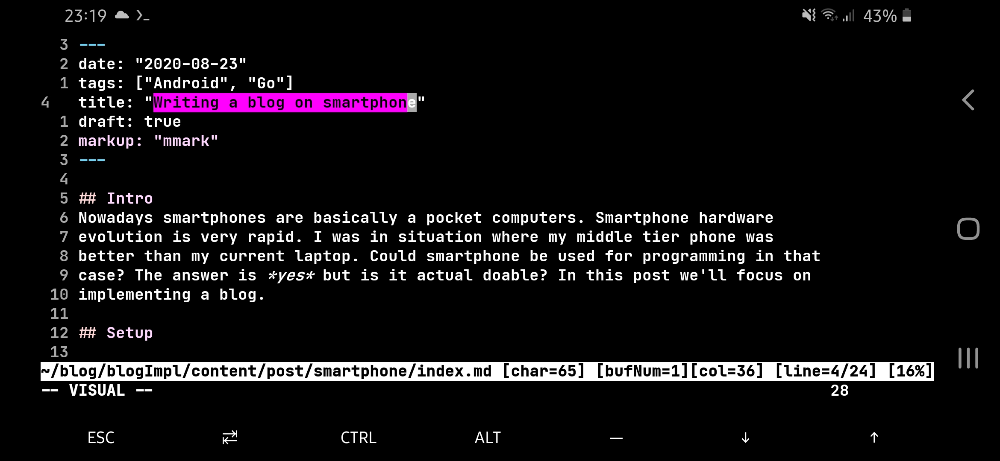
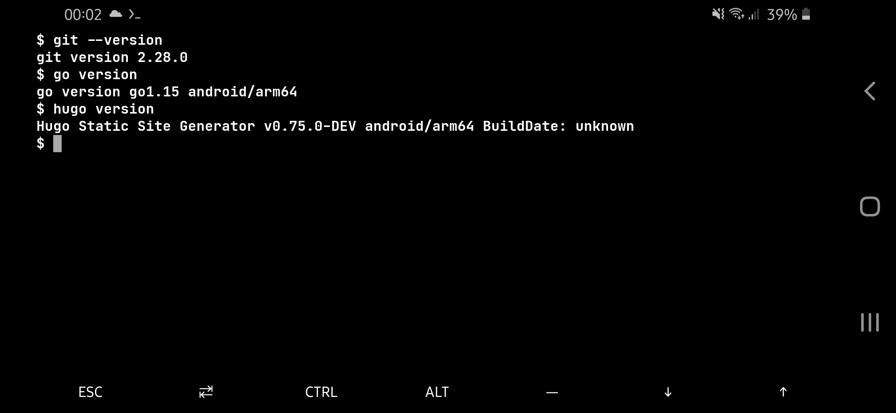
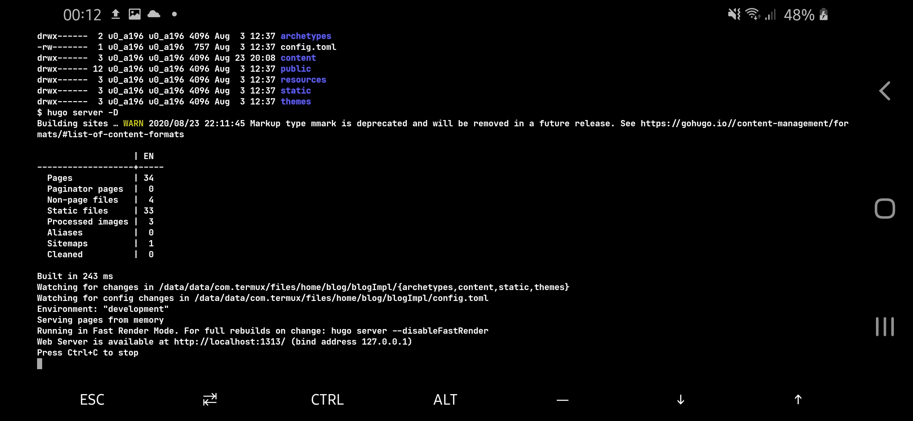
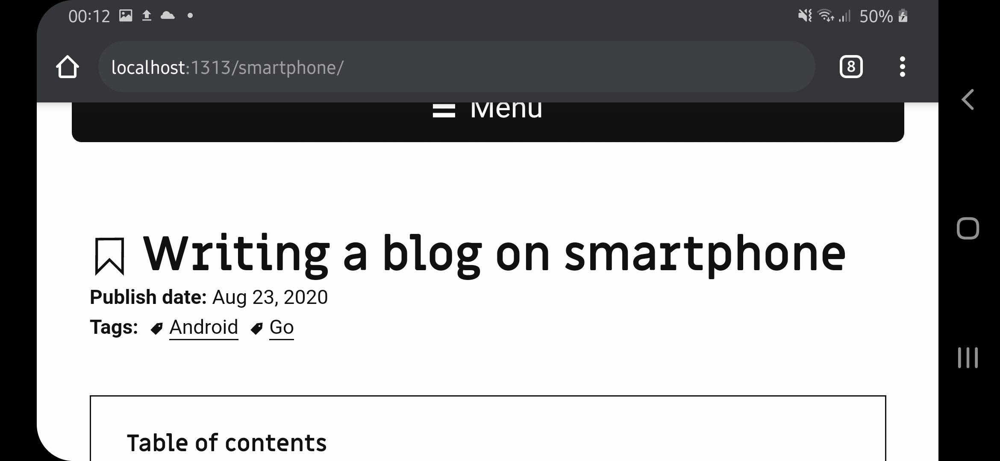

## Intro
Nowadays smartphones are basically a pocket computers. Smartphone hardware
evolution is very rapid. I was in a situation where my middle-tier phone was
better than my current laptop. Could smartphone be used for programming in that
case? The answer is *yes* but is it actual feasible? In this post we'll focus on
implementing a blog on a Android smartphone.

I've been using my smartphone to play with C++, Go, Vim and practice UNIX programs
like AWK and grep for quite some time now. I feel safe when I can code on my 
smartphone which is equivalent to be able to code anytime and everywhere. 
Recently I've realized that I'm using a tool written in Go to generate this
blog and I have a Go compiler on my phone. So why not to try write a blog 
post on the phone? I did and it went better then I expected.


## Setup

My main development environment on Android phone is
[Termux](https://termux.com/) application which is a terminal emulator with
Linux environment. I do really love it.  I'm (and most of Android phones are)
on Android OS using ARM architecture CPU.  So we can use any program and
programming language which is compatible with this OS and architecture.

In term of technological stack I've selected the same which is used by this
blog - [Hugo](https://gohugo.io/). To prepare Termux for writing a blog on our
smartphone we'll need to install:

* **Go** programming language - `pkg install golang` 
* **git** for communication with outside World - `pkg install git` 

In order to use Hugo we'll compile it from the source code. Hugo is written in
Go so it'll be a one-liner. The following code clones Hugo repository and build
its binary based on the source code.

```
git clone https://github.com/gohugoio/hugo 
cd hugo 
go build -v
```

Go compiler will fetch and compile all of required dependencies. For
convenience add Hugo to your path. One way to do that is to add the 
following line in your `.bashrc` file (on Termux you might have to 
create `~/.bashrc`)

```
PATH=$PATH:~/your/path/to/hugo
```

After extending your `PATH` you'll need to restart Termux or run
`termux-reload-settings`.




## Workflow

After the setup we're ready to write a blog and use Hugo to generate actual
website from the source code. I'd recommend to do [initial
setup](https://gohugo.io/getting-started/quick-start/) of Hugo project on
actual PC or laptop. In my case I've configured the project and I've put it on
my GitHub. Next using git I've cloned the project into Termux on my smartphone.
Now I'm ready to edit or create content of my blog. To do that you'll have to
use one of terminal-based text editor. I use vim but you can also install
either nano or Emacs. Once the content is ready you can compile your blog and
preview it in your browser on your phone!



Compilation is done by running `hugo server -D` inside top level catalog of
your blog source code. Next we can jump into our browser on given localhost
address - *http://localhost:1313/*.



## Conclusions

First time I did it I was shocked how smooth it went. I did not have a single
error while installing Go or compiling and using Hugo on Android phone.
At that moment I felt what real cross-platform feels like. From this point I
even more like Go (and C++). It's a pity I cannot say the same about C#.
The .NET core is not currently ported to Termux.

To sum up. We've used Linux, git, Go, vim and Hugo to setup a environment for
developing a blog and running it locally on the Android smartphone! In my
opinion this is amazing. It's literally the same setup I'm using on my laptop.
The only difference is smaller screen. But on the another hand smartphone
accessibility is far greater for most people then even a lightweight laptop.

Getting back to our main question *The answer is yes but is it actual feasible?*.
Using Termux on the phone give us the possibility. In my opinion writing a
blog, playing around with code samples, using \*UNIX programs and *read* a
project source code can be even effective(\*) in this environment. But developing
actual project can be a bit hard. Mainly due to small screen and not efficient
keyboard obviously. However I was surprised how many things around programming can be
feasible using Termux.

(\*) Assuming you're familiar with a terminal-based text editor like Vim, nano
or Emacs. 


## References

1. [Termux](https://termux.com/)
2. [Hugo](https://gohugo.io/)
