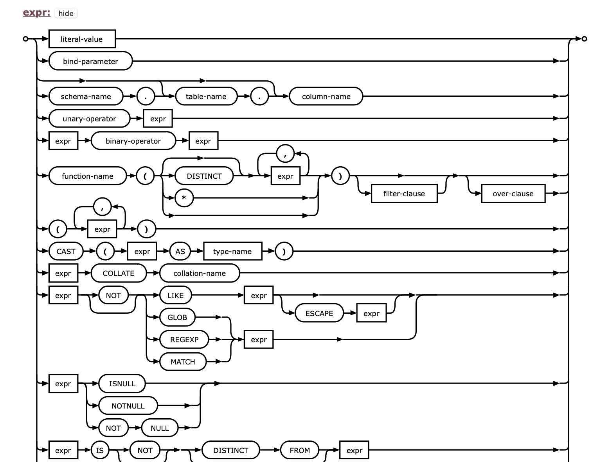

## Intro

About a year ago I've played a bit with [parsing T-SQL](https://dskrzypiec.dev/parsing-tsql). At the time I've used
Microsoft library and ANTLR for generating lexer and parser based on predefined T-SQL grammar. Recently I've come back
to this topic. I've implemented [SQLite](https://www.sqlite.org/index.html) parser almost from scratch (without code
generation).


## ..., but why?

In general I wanted to have a SQL parser in order to build some kind of static analyzer tool for SQL and databases. One
might ask why I just haven't taken source code from Postgres parser or SQLite? There are few reasons

* I didn't want C (or C++) for this particular side project at the time
* I wanted to try to unify more then one SQL dialect into single project
* Going through the full parser source code would require a bit too much work for a side project

Another question might be why haven't I used [ANTLR](https://dskrzypiec.dev/parsing-tsql) or another tool for
automatically generate parser source code based on grammar definition. The main reason was that I didn't really like
structure of the parse tree and emphasis for visitor pattern. Also I wouldn't easily work to combine few SQL dialects
other than defining those separately.

I once tried to implement a parser from scratch in Go. It was probably the best approach, but it was still a bit too
much hassle for a side project to implement most of SQL grammar. But recently, while I was learning Scala, I found
[fastparse](https://github.com/com-lihaoyi/fastparse) library.


## *fastparse* library

The fastparse library is an implementation of [parser combinators](https://en.wikipedia.org/wiki/Parser_combinator)
functional approach of writing parsers. Till that point I didn't know about this approach of writing parsers. I
instantly liked it. Moreover fastparse provide a set of basic parsers which are very generic, so it's easy to start
writing parsers.


### Example

To get a bit better feeling about fastparse library let's consider the following code snippet.

```
def digit[_ : P] = P(CharIn("0-9"))
def dot[_ : P] = P(".")

// .334
def decimalFromDot[_ : P]: P[SqliteDoubleLit] = {
  P(dot ~ digit.rep(1)).!.map {
    num => SqliteDoubleLit(num.toDouble)
  }
}
```

There are three Scala generic functions. First two are very simple parsers. The first one - `digit` parses a single
digit or fails. Similar `dot` parses single dot character or fails. Parser `decimalFromDot` parses decimal literals
which start with dot, like `.334` and not `0.334`. Firstly let's notice that this parser is of type `SqliteDoubleLit`,
so in case when parser succeeded then result will be of this type. Now let's untangle this parsers notation a bit

1. First character should be a dot - we are using `dot` parser
1. `~` means in fastparse "AND", so after the dot the following must occur
1. at least one digit - this is expressed by `digit` parser and fastparse `rep` function which repeats given parser
1. Exclamation mark `!` means that we want to *capture* result of this parsing in case of success
1. Finally `map`, in case of success, maps captured text into desired `SqliteDoubleLit`.

So even in this very straightforward example we are combining two other simpler parsers and couple of basic operators
and functions from fastparse library. In actual implementation I later used this parser in literal parser which parsers
string literals, integer literals and so on. But it's very convenient to have this parser separated. It's very easy to
unit test and to use them in other places.

If you're interested and want explore more about fastparse I'd recommend official
[documentation](https://com-lihaoyi.github.io/fastparse/).


## SQLite expression

At this point we're prepared to implement a SQL parser in Scala using fastparse library. We've got tools. Now the main
question is where to even start? My first thought was around `SELECT` statement but I quickly realized that it require
many parts to be already parsed. The second one was to start from a leaf of the parse tree. But which one? As I was
browsing through SQLite grammar I realized that almost everywhere occurs an expression `expr`. Column might be defined
as expression, in `JOIN` constrains we got expression, in `WHERE` clause there is logical expression. In `ORDER BY`,
`LIMIT` and almost any other component SQLite expression might occur. It's everywhere! After this realization I was
convinced that I have to start from implementing parsing [SQLite expression](https://www.sqlite.org/lang_expr.html). The
picture on the top presents visual representation of `expr` grammar and it's not complete!

As you can see even parsing just an expression is not a trivial task. There are few points that shall be taken into
consideration before implementing this parser. That is - operators precedence order, recursive nature of an expression
and complexity of possible cases. Nevertheless it should be implemented before anything else. As I expected it was a
good decision. Everything after implementing and testing parsing an expression was rather joyful.

That might be obvious but perhaps it's worth to mention how I represented SQLite expression in Scala. I think the
natural way of expressing this kind of objects is through [sum type](https://en.wikipedia.org/wiki/Algebraic_data_type)
using Scala traits and inheritance.

```
sealed trait SqliteToken
sealed trait SqliteExpr extends SqliteToken

sealed trait SqliteLiteral extends SqliteExpr
case class SqliteIntegerLit(value: Int) extends SqliteLiteral
case class SqliteDoubleLit(value: Double) extends SqliteLiteral
case class SqliteHexLit(input: String, value: Int) extends SqliteLiteral
case class SqliteStringLit(value: String) extends SqliteLiteral
case class SqliteBlobLit(value: String) extends SqliteLiteral
case class SqliteNull() extends SqliteLiteral
case class SqliteTrue() extends SqliteLiteral
case class SqliteFalse() extends SqliteLiteral
case class SqliteCurrentTimestamp() extends SqliteLiteral
case class SqliteCurrentTime() extends SqliteLiteral
case class SqliteCurrentDate() extends SqliteLiteral
case class SqliteLiteralError() extends SqliteLiteral

case class SqliteColumnExpr(
  schemaName: Option[String] = None,
  tableName: Option[String] = None,
  columnName: String
) extends SqliteExpr

case class SqliteCaseExpr(
  initalExpr: Option[SqliteExpr] = None,
  whenThens: List[SqliteCaseWhenThen],
  elseExpr: Option[SqliteExpr] = None
) extends SqliteExpr

case class SqliteCaseWhenThen(when: SqliteExpr, then: SqliteExpr)

// and so on ...
```

For parsed `SqliteExpr` object we can pattern match onto concrete representation very easily in Scala.


## Reflections

My general reflection after implementing SQLite `SELECT` parser using fastparse is that, once you're familiar with this
library writing parsers is almost as trivial as specifying just a grammar. The overhead is very low but advantages are
great in my opinion. I could unit test each little step for each little parsers I've implemented. Lexing part, scanning text
into tokens, is entirely omitted and the outcome representation in the parse tree might be a bit different (simpler)
than grammar. In ANTLR it's not possible.

I'm very far of being an expert of fastparse but as far as I know it's not very easy to customize parsing error
messages. There are some functionalities to handle it better but for sure it's worse than in case of hand-written
parser. Overall I'm very satisfied with the result.


## Let's format SQL

Ok, let's say I'm in the moment when I've implemented and fairly tested SQLite `SELECT` parser. What can I do with it?
I had many ideas even before starting this side project. I've decided to implement formatting SQL queries based on
parsed tree. Firstly it's visual appealing. Secondly it touches all nodes of the parse tree, so it's a good overall
test.

Back when I was working in PwC there was a period when I was writing mainly T-SQL daily. I was easily over a million
lines of SQL in total over two or three years. After some time I started to format code in the way I thought was the
most readable. And I stick to it. Even to this day I have this formatting in my muscle memory. So I knew exactly how I
wanted to implement this SQL formatter. There is no need for configuration. I just want to implement my style. Just like
[go fmt](https://pkg.go.dev/cmd/gofmt) does.

For example let's take this made up query:

`with tmp1 as (select a, b, a + b * 13 as c from src.table1), tmp2 as (select * from another.table2 where x > 42) select
t1.a, t1.b, t1.c, t2.crap, x.X from tmp1 t1 left join tmp2 t2 on t1.a > t2.crap inner join ( select col1, X from
src.crap c inner join dict.crap c2 on c.col1 = c2.col1_dict) as x on t2.crap = x.col1 where t1.a + x.X > -12 LIMIT 10`

It's a single line, almost all lowercase and no indentation. My formatter turn this into the following:

```
WITH tmp1 AS (
    SELECT
        a,
        b,
        a + b * 13 AS c
    FROM
        src.table1
),
tmp2 AS (
    SELECT
        *
    FROM
        another.table2
    WHERE
        x > 42
)
SELECT
    t1.a,
    t1.b,
    t1.c,
    t2.crap,
    x.X
FROM
    tmp1 AS t1
LEFT JOIN
    tmp2 AS t2 ON t1.a > t2.crap
INNER JOIN
    (
        SELECT
            col1,
            X
        FROM
            src.crap AS c
        INNER JOIN
            dict.crap AS c2 ON c.col1 = c2.col1_dict
    ) AS x ON t2.crap = x.col1
WHERE
    t1.a + x.X > -12
LIMIT
    10
```

As you can see the formatter work properly in case of recursion (sub-query). In this case it adds another level of
indentation. All keywords and clauses are now uppercase. Indentation is consistent. Once you have a parse tree
implementing this formatter was done in single evening. It was straightforward.


## Summary

Overall that was a very good experience. I'm very happy about it. I'm glad that I found fastparse library. Without this
library I probably wouldn't decide to implement hand-written SQL parser on the side. Development process was very swift.
I'm a bit concerned about parsing error handling. And because of that I'm not yet sure if I would use this library to
implement production ready and complex parser. In the case when parser would be the foundation to another tools I'd
probably go with hand-written version. But even in this case I think I'd try to use parser combinators approach to do
so.


PS. I haven't implemented full SQLite parser. Just `SELECT`, but that should cover most common queries.

PS2. This parser is not yet open sourced. If that happen I'll put link here.


## References

1. [fastparse](https://github.com/com-lihaoyi/fastparse)
1. [fastparse docs](https://com-lihaoyi.github.io/fastparse/)
1. [parser combinators](https://en.wikipedia.org/wiki/Parser_combinator)
