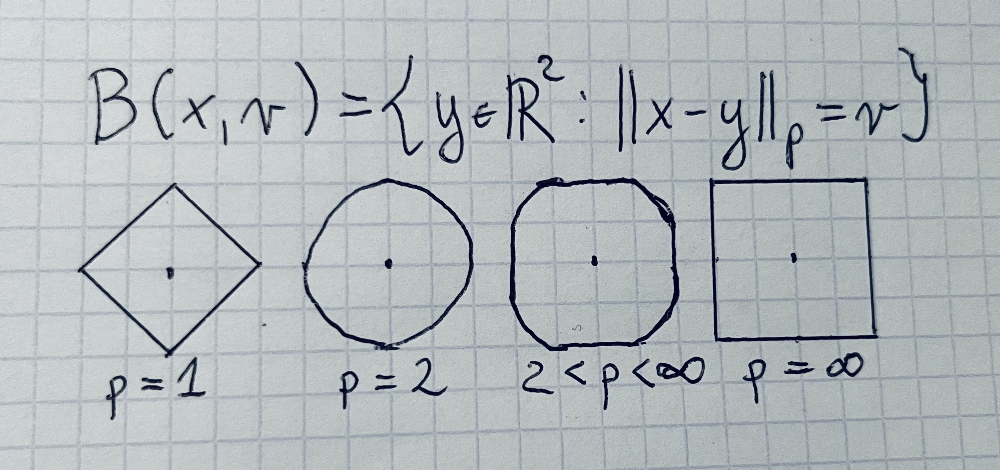

## Intro

I was thinking of getting tattoo for my 30th birthday but somehow I missed it. I couldn't find any interesting for me
ideas for a tattoo. I think it wasn't the right time. Recently I started to thinking about it again. I was looking for
maths and CS related ideas expressed as good looking tattoos. I didn't find anything I would like. There were many
cliché like [Pythagorean theorem](https://en.wikipedia.org/wiki/Pythagorean_theorem) or [Euler
identity](https://en.wikipedia.org/wiki/Euler%27s_identity). At least those are cliché in my opinion. So... I decided to
design tattoo myself.

What do I mean by "design"? I mean selecting interesting mathematical (STEM in general) object or concept which can be
visually appealing and possible to make it in form of a tattoo. Once I picked the concept I try to work on formulation
and composition. But unfortunately there my design ends. I don't design regarding background, colors, shading, type and
weight of lines. I think it should be up for tattoo artist or personal preference. Even though my design seems to be
limited in some way it was still a very interesting exercise.

If you like my designs and you would like to use them, please feel free to do so. Additionally if you want to share the
final outcome with me, please don't hesitate. I'd love that.

I hope I'll be updating this blog post with new designs over time.

## Cantor set

### Explanation

The above design presents few steps of Cantor set construction and its formula. [Cantor
set](https://en.wikipedia.org/wiki/Cantor_set) is very peculiar set with some very interesting properties.
Constructions of this set is going as follows:

1. We start from `[0, 1]` closed interval
1. We divide it in three equal parts and remove the middle one
1. We do the same thing for each part obtained in the previous step
1. We do it indefinitely
1. What's left from `[0, 1]` interval after infinite number of iteration is called Cantor set

Each line on the drawing represents a step in that process. I could draw only five first steps the construction
algorithm due to line thickness. That's why the formula above the lines is required. Cantor set cannot really be drawn
in real world. Few first lines gives us the intuition what next iteration would look like but at the end the formula
gives us precise definition of that object. Without the formula those lines would be just a random lines. It still
could be a cool tattoo, but in my opinion both pieces makes it both looking cool and representing very interesting
mathematical object.

### Why?

Cantor set is an interesting object and the construction process looks visually cool in my opinion. For me there is no
deeper meaning.

## Spheres in metric spaces

### Explanation

### Why?

## References

1. [Apache Parquet](https://parquet.apache.org)
