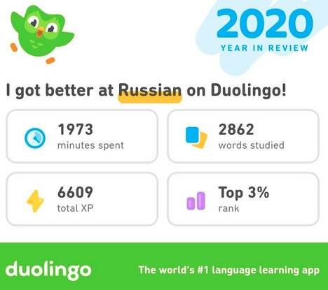

## Intro
Starting from this year on I'll try to make a post per year with summary
of my personal and professional important events within the year.

## 2020 highlights

1. Finished application for a factoring company
1. SARS-CoV-2
1. Changed team and position at work
1. I've started learning Russian
1. I've build a PC
1. My daughter was born

## Finished application for a factoring company

In April 2020 I've finished working on the project for a factoring company. The
main goal of the project was to build an application for calculating some
specific formulas and models for risk management. This project was special for
me because it was __mine__ project. I was the manager, developer, PMO and
tester. I've designed the database. I've gone through all historical data and
I've studied legacy models and calculations. I've sketched core of the
application and I've implemented most of the functionalities. Rest of
functionalities was implemented by two interns and one junior dev under my
supervision. I was also the one responsible for the communication with the
client.

As one can expect it was a bit too much. I've spent many nights and few
weekends to meet the hard deadline but I've done it. After that I said "never
again" and I've changed teams at work. I learned a lot but the price was too high.
Especially with the one-year-old boy at home.

## SARS-CoV-2

Coronavirus pandemic globally was the most significant "event" of the 2020.
About March-April number of cases in Poland started to grow. Just before April
I've moved into home office. Till today I still work from home. For me
personally it wasn't any inconvenience due to my IT related position.

Home office was especially useful after my second child was born in October.
Not wasting time and effort for commuting to the office was a big advantage.

Luckily I haven't got any symptoms of COVID-19 and neither anyone from my
closest family.

## Changed team and position at work

Starting from May I've pivoted to *Senior Backend Engineer* in a team
responsible **only** for developing system applications. Before this transition
I had many roles. I had been doing what needed to be done including data
mining, testing, modelling and programming in general. All of this hidden under
a broad title *Senior Associate*.

In 2019 I've decided that system programming using statically typed and
compiled languages is what I want to do. After the transition daily average time of
meetings went from four hours to half an hour. Stress level also decreased
mostly due to fact that now I don't have direct contact with clients. I'm
*just* a programmer. Nevertheless I'm doing interesting things around
interesting people but with better work-life balance.

## I've started learning Russian

In about June 2020 I've started to learn Russian using
[Duolingo](https://www.duolingo.com/) app. At the beginning I've performed 135
days strike (consecutive days with at least single lesson a day). I've got 5-10
days break and at this moment I'm over 100 days strike. I'm glad I've developed
a habit of learning or at least memorizing Russian every single day. I hope
I'll keep it up in 2021.

Я надеюсь хорошо говорить по-русски в 2021 году.

## I've build a PC

At the end of September 2020 [I've build a mini ITX PC by myself.](https://dskrzypiec.dev/minipc/)

## My daughter was born

In October my second child and the first daughter was born. At the time my
oldest son was almost two years old. For me and my wife it was (and still is)
very challenging situation which requires a lot of patience, strength and
motivation. After almost three months I see the light at the end of the tunnel.

Due to COVID-19 pandemic restriction I couldn't be in the hospital during and
after the birth but fortunately it went very smooth without any problems.

## Summary of 2020

It was for sure the one year which was the most different from previous ones.
Mostly due to the whole global COVID-19 pandemic and its implications.

In general I think it was a good year for me. I've changed my career. I've been
working from home most of the year. My daughter was born. I've started
developing [Home Database](https://dskrzypiec.dev/home-db/). I didn't catch
COVID-19 (at least without symptoms). So far, so good. Looking forward into
2021 :)

