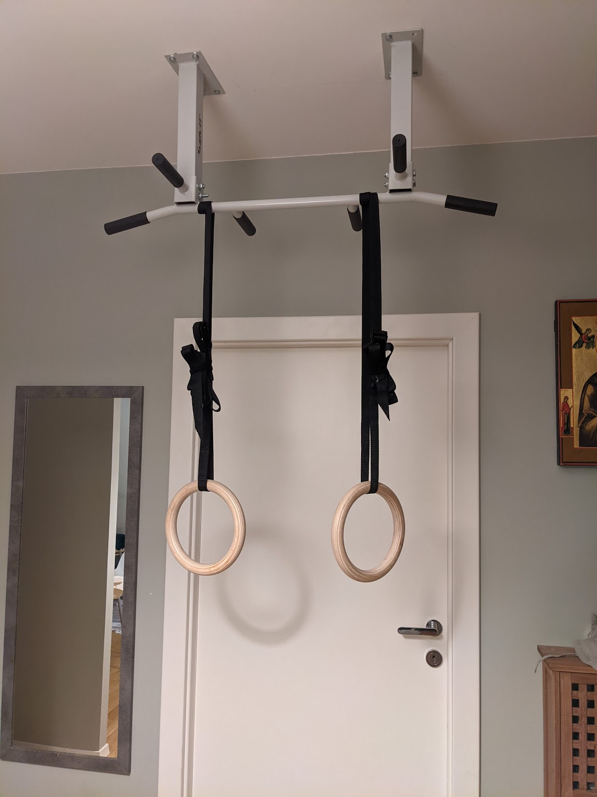

## Started jogging

In January, after a long pandemic home isolation I've started jogging. For
my whole life I always hate jogging. I love most sports but running was
something else. After almost a year in pandemic with gyms being closed and
almost no going outside I though that I'll give it a try.

At first two tries I couldn't run 500 meters without a break for catching a
breath. Unexpectedly body adaptation was very quick! After two weeks I could
run over 1500m without any break. That was very motivating.

I've kept running through the whole year. I started to like jogging after the
first two or three weeks of doing it, just when my endurance increased to the
level when jogging wasn't dying for me.

## My first MacBook Air (M1)

I've never been much of an Apple fan. At the end of 2020 Apple released the
first Mac Book with their own processor - M1. Reviews were amazing. I was very
interested. In March 2021 I decided to buy MacBook Air M1. Up to this point
I'm very happy with this choice. Performance is great, battery life is amazing
(still around 15-20h) and general build quality is beyond my expectations.

## Still trying to learn Russian

For the first seven months of 2021 I continued my path in learning Russian.
My main source was still Duolingo. At some point I've realized that I need
face-to-face or more traditional lessons because I couldn't properly learn
pronunciation based only on the app. Shortly after this realization I've
changed a job and I choose to take a little break from Russian till I've got
comfortable in a new job.

Surely I want to continue learning Russian but I think I'll adjust a bit my
methods in 2022.

## I have left PwC and joined Allegro Pay

In August 2021 [I left PwC](https://dskrzypiec.dev/leaving-pwc) and I've joined
Allegro Pay DEA team as senior data engineer. Allegro Pay is a sub company of
[Allegro](https://about.allegro.eu/who-we-are/at-a-glance) the biggest
e-commerce in Poland (and in central Europe) which is responsible for its
financial products.

## I run my first Runmageddon

On September, 4th I've run my first [Runmageddon](https://www.runmageddon.pl).
Distance was 5 kilometers with over 30 challenges. It took me over two hours to
finish the run.

There was many interesting challenges during the run like running through cold
[Baltic Sea](https://en.wikipedia.org/wiki/Baltic_Sea), then crawling for 500
meters under the barbed wire and diving into the ice box.

I really liked the experience. It was an interesting training but done in very
different way. I'll definitely do it again in 2022.

## Pull-up bar

My main conclusion after Runmageddon was that I have to work on my pull ups.
Indirect consequence of this was setting up a pull up bar in my hall two weeks
after Runmageddon. It was my best decision made in entire 2021!

Having a pull up bar in my home enabled daily pull ups session. At the
beginning I cannot do even single proper pull up (without rubber band). After
two months of trainings I now can do few (2-4) series of 4-7 pull ups and chin
ups with proper form.

Having a pull up bar also direct my interests in calisthenics. At this point I
can do full body workout at home. I'll continue my journey with calisthenics in
2022 for sure.

## Summary

The year 2021 I can sum up as me getting into shape and changing a job. I lost
around 15kg (33lb). I can run over 5km. I can perform over 5 proper pull ups.
In October 2022 I'll enter my thirties. I'd like to do it being fit, strong and
flexible both mentally and physically.

