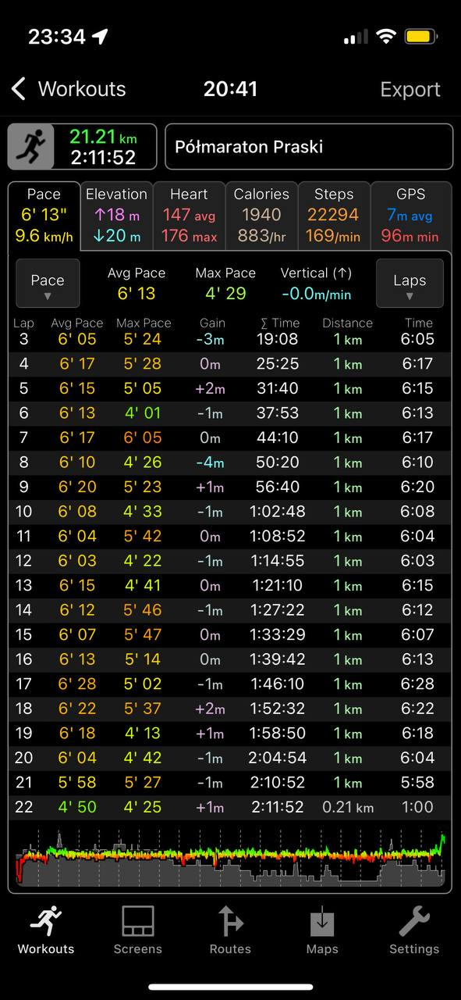
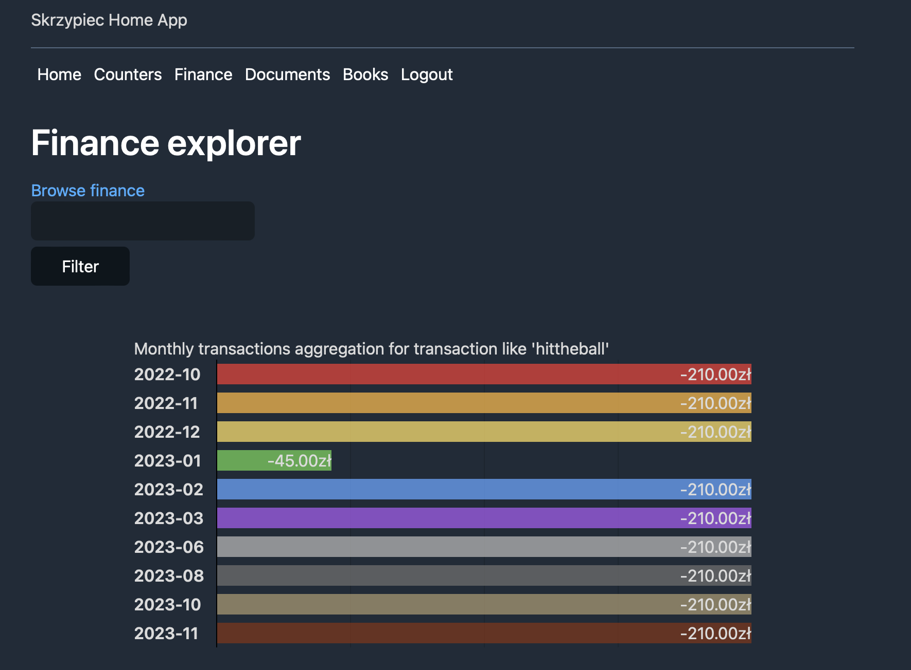

## Continuation of 2022

In 2023, I maintained my running routine, pursued table tennis training, and practiced fundamental calisthenics,
including pull-ups, push-ups, and dips. However, I decided to discontinue my Russian language studies.

## I've left TCL and joined Point72

**TODO**

## Running

This year I continued my practice of running. At this point I enjoy running quite a lot. I try to go for a run at
least 3 times a week. I try to do two runs on weekdays within distance range 7.5-11.5km (4.6-7.2 miles) and one
longer run on weekends. In March I've run my first half marathon in over two and a half hours (2:34). In September I've
run my second half marathon. This time I've done it in two hours and eleven minutes.

I'm very happy with the progress! I'm planning to run another one in March 2024 and the goal is to break two hours.
This year I've also run another [Runmageddon](https://www.runmageddon.pl). This time I choose _classic_ version which
is around 12km distance and over 50 obstacles to overcome. That was a goal from 2022. I'm glad I did it.

## Started working on implementing New Scheduler

**TODO**

## HomeApp v2

Over a year ago I've [rewritten Home App in Go](https://dskrzypiec.dev/home-app-go/) and moved it onto AWS. That was
great decision! We use HomeApp on regular basis. Corresponding Home Database grew to 1 GB in size, over 300 digitalized
documents, over 40 e-books and around 8500 bank transactions. Having HomeApp open publicly (not behind private VPN)
made it much easier accessible.

In 2023 I've added two new features. One is mentioned uploading/downloading of e-books. The other one is Financial
explorer which basically aggregates all financial transactions which contains given phrase in a description on month
level. It looks like this:

It's rather simple but still very effective regarding looking into trends of our expenses.

## Learned about HTTPS, TLS and cryptography

**TODO**

## Goals for 2024

* Run half marathon in under two hours.
* Try to run my first full marathon.
* Continue working on New Scheduler.
* Got better in writing frontends.

## Summary

