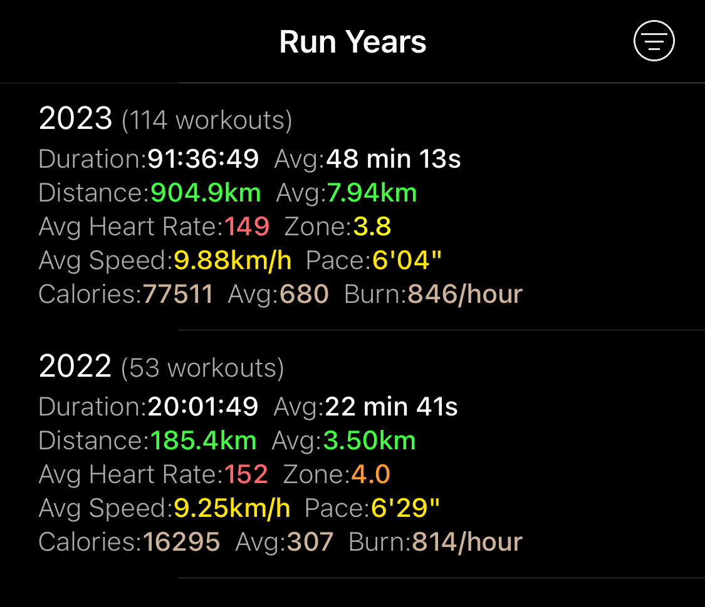

## Continuation of 2022

I would like to start by mentioning the things I continued doing in 2023, beginning with sports. I maintained my
running routine, pursued table tennis training, and practiced fundamental calisthenics, including pull-ups, push-ups,
and dips. However, I decided to discontinue my Russian language studies, mostly due to lack of time. As for my MacBook
Air M1 from 2020, it's still in pretty decent condition, even after nearly three years of heavy usage. The battery life
is around 7-8 hours at this point.

## I've left TCL and joined Point72

At the end of January 2023, I left TCL Research Europe, where I had been working as a Senior Cloud Engineer. Shortly
afterward, on February 2nd, I joined the Risk Technology team at Point72 (Warsaw office) as a Software Engineer. Before
I delve into why I changed my job, let me summarize my experiences and reflections from working at TCL, as I haven’t
done so in a separate post, unlike when [I left PwC](https://dskrzypiec.dev/leaving-pwc/) or [Allegro
Pay](https://dskrzypiec.dev/allegropay/).

The first thing that struck me at TCL was the culture shock. As a primarily Chinese company, it was quite unusual to
receive over 90% of emails written in simplified Chinese without an English translation. The language barrier was
rather high overall. Very few people outside of the Warsaw office spoke communicative verbal English. This reached a
point where meetings were conducted in Chinese, and a colleague in the Warsaw office, who is fluent in both Chinese and
English, had to translate communication both ways. Fortunately, such meetings were rare, but it was still quite
surprising. Another interesting fact was that Chinese colleagues used [WeChat](https://www.wechat.com) for corporate
communication. They used WeChat personally, much like how people in Europe or the US use Messenger or WhatsApp, but
they also used the same account for corporate communication. For everyday communication in the Warsaw office, we used
Slack, but when we needed to contact developers from the Chinese office, we had to use WeChat.

I was part of the team responsible for building an overseas big data platform – a data analytics platform for all
offices outside of Asia. The work involved mostly data engineering with BI and reporting layers. Interestingly, the
entire platform was built on AWS, existing purely in the cloud. This meant that we had development and test
environments also on AWS. Pipelines in repositories were usually creating pieces of infrastructure needed for the
related part of the platform, including personal environments, end-to-end test environments, and so on, all across
seven or eight AWS regions. This was quite impressive and already set up when I joined. In those pipelines, we used
[AWS CDK](https://aws.amazon.com/cdk/). Practically every part of the platform, besides the actual source code for the
service or functionality, had a corresponding AWS CDK project dedicated to defining related infrastructure on AWS.
During my time at TCL, I used Scala (mostly for Spark in the form of AWS Glue jobs), Python for other services, and
TypeScript for writing AWS CDK projects for the infrastructure. It was fascinating to see how a few people could build
a complex data platform leveraging AWS and its tools.

Even though I was only at TCL for six months, I really enjoyed learning and contributing to the project. It was
definitely a new experience for me, and I’m glad to have had the opportunity to approach software building in this
manner. Of course, it wasn’t perfect. I think the cost of building everything on AWS is quite high, and using many AWS
services creates challenges in terms of system observability. Nevertheless, it was a great opportunity to work in a
different way.

Why did I quit? I'd say it was a stroke of luck. Around December 2022, my team in Warsaw started to notice changes at
TCL. We lost one of our main projects (not the platform) unexpectedly and observed a few other signs of potential
budget optimization. Perhaps this was due to the economic situation in Asia post-COVID pandemic; I’m not entirely sure,
but we certainly felt the impact. Around the same time, I received an offer from Point72. I didn’t want to leave my
team after just six months, but given the uncertainty of my team's future at TCL and the fact that the role and
responsibilities in the offer from Point72 were a great match for me, I decided to leave. It wasn’t an easy decision.

That’s how, since February 2023, I have been building a new scalable computation and analytics platform for the Risk
team at Point72. As we are also using AWS here, my previous experiences at TCL are proving valuable for both me and my
current team.

## Running

This year I continued my practice of running. At this point I enjoy running quite a lot. I try to go for a run at
least 3 times a week. I try to do two runs on weekdays within distance range 7.5-11.5km (4.6-7.2 miles) and one
longer run on weekends. In March I've run my first half marathon in over two and a half hours (2:34). In September I've
run my second half marathon. This time I've done it in two hours and eleven minutes.

I'm very happy with the progress! I'm planning to run another one in March 2024 and the goal is to break two hours.
This year I've also run another [Runmageddon](https://www.runmageddon.pl). This time I choose _classic_ version which
is around 12km distance and over 50 obstacles to overcome. That was a goal from 2022. I'm glad I did it.

My running trainings summary over the last two years:

I'm very happy to see, that my average run duration increased to almost 50 minutes and pace declined to around 6
minutes per kilometer. My current pace average is around 5'37" per kilometer on 10km runs, so I hope to get much better
results in 2024.

## Started working on implementing New Scheduler

In August 2023 I started working on my version of a scheduler. I wrote a post on this in here - [New
Scheduler](https://dskrzypiec.dev/new-scheduler/). Goal for 2024 is implementing most of fundamental functionalities,
including the UI.

In general progress is pretty slow, since I'm spending around 8-10 hours per week on this project, but it is nice to
have solid long term project. I enjoy working on it.

## HomeApp v2

Over a year ago I've [rewritten Home App in Go](https://dskrzypiec.dev/home-app-go/) and moved it onto AWS. That was
great decision! We (me and my wife) use HomeApp on regular basis. Corresponding Home Database grew to 1 GB in size,
over 300 digitalized documents, over 40 e-books and around 8500 bank transactions. Having HomeApp open publicly (not
behind private VPN) made it much more accessible.

In 2023 I've added two new features. One is mentioned uploading/downloading of e-books. The other one is Financial
explorer which basically aggregates all financial transactions which contains given phrase in a description on month
level. It looks like this:

It's rather simple but still very effective regarding looking into trends of our expenses.

## Learned about HTTPS, TLS and cryptography

Around October or November 2023 I've received significantly bigger, then usually bill from AWS. As it turned out my
first 12 months on AWS has passed and at the same time my discount on EC2 and elastic load balancing. I've been using
the second smallest EC2 instance, so that wasn't the main part of the bill. It was ELB. Why I used ELB in the first
place? I didn't have multiple EC2s to load balance traffic. I've set it up, because on AWS it's the easiest way to
setup HTTPS via trivial load balancer and target groups. In this setup I can use certificate from AWS. That was the
only reason.

In that moment I decided it's the time to learn about `S` in HTTPS. It wasn't because of money. I treated is as
reminder that this is the high time to pay technical debt of not learning those things before I publish HomeApp on AWS.

I could probably take another shortcut and use ChatGPT, to setup HTTPS for HomeApp without using AWS Load Balancer and
certificate from AWS. I didn't want to do it. I wanted to actually learn about those concepts. So I did. I learned
about certificates, chain of trust, how those are generated, signed and verified. Next I learned about asymmetric and
symmetric encryption. About [RSA](https://en.wikipedia.org/wiki/RSA_(cryptosystem)) and
[Diffie-Hellman](https://en.wikipedia.org/wiki/Diffie–Hellman_key_exchange). I looked into mathematics behind those
algorithms and systems. It turned out that cryptography is very interesting and very elegant in many aspects. I really
enjoyed it. On high level I learned also about SSL and TLS protocols which combines most of the above concepts.

Eventually I've setup HTTPS for HomeApp using certificate generated by [Let's Encrypt](https://letsencrypt.org) and
getting rid of AWS LB. I ended up with simpler infrastructure for HomeApp, lower AWS bill, and obtained very
interesting and useful knowledge on cryptography.

## Goals for 2024

Starting from now on I'll try to include goals for the next year in those annual summary posts. Goals for upcoming year
2024 are as follows:

* Run half marathon in under two hours.
* Run my first full marathon (in ~4:30?).
* Continue working on New Scheduler.
* Come up with the name for New Scheduler.
* Got better in writing frontends (Go + tmpl + HTMX?).
* Read a textbook on quantum mechanics.

## Summary

Overall I think it was a very good year for me! I made progress in running, changed a job, learned few things and
started my first serious side project. I'm looking forward to 2024 and my next goals!

