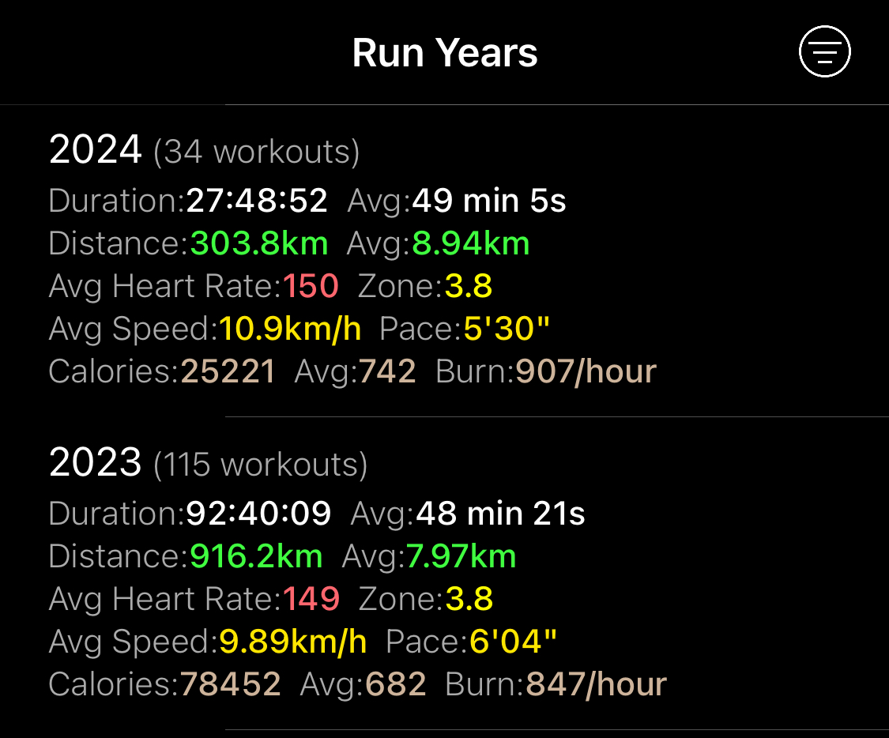
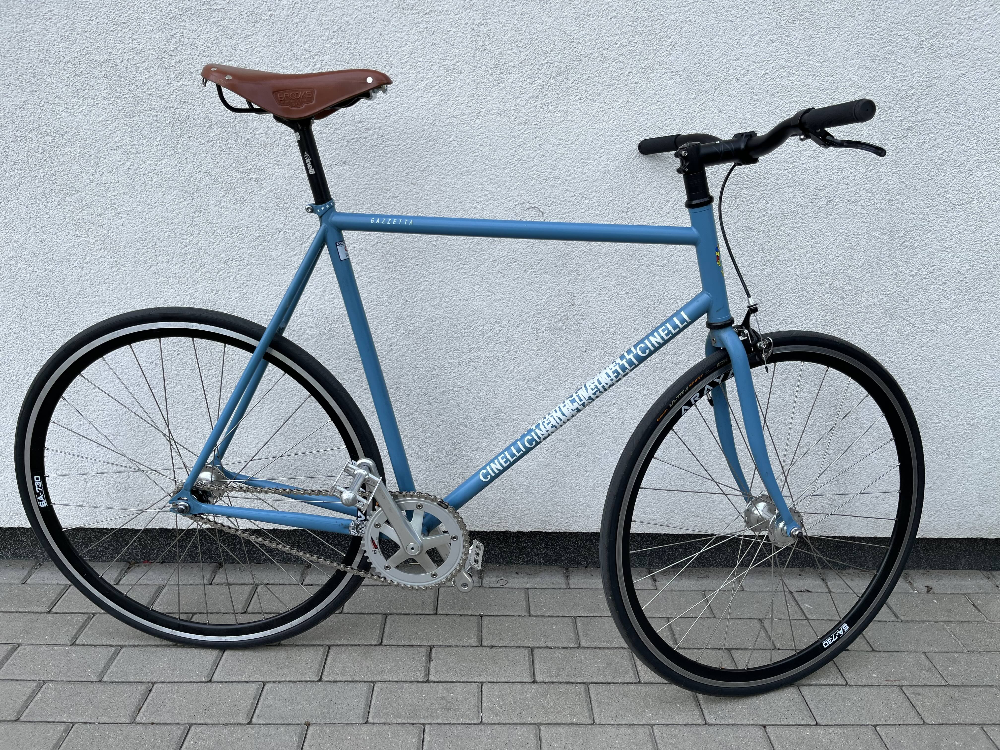
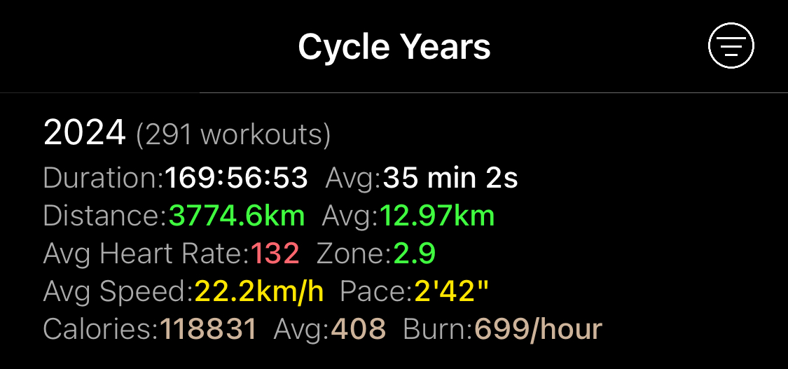
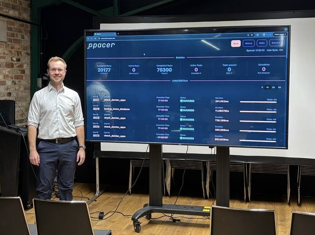
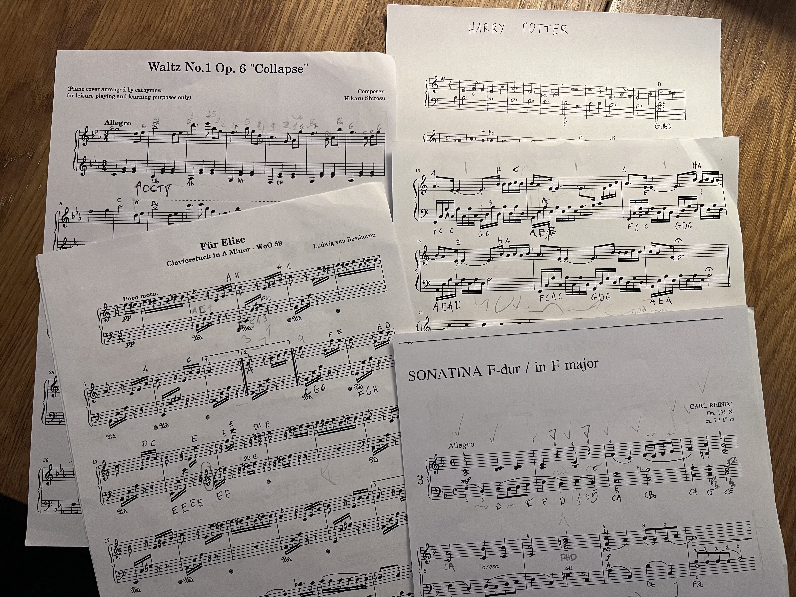

## Intro

Time flies! It's time to summarize the year 2024. For additional context you
might want to check the [summary of 2023](https://dskrzypiec.dev/year2023).

## Running paused

The beginning of 2024 (January, February) was a period of intense running
training in preparation for the Warsaw Half Marathon. I intended to achieve a
time below 2 hours (around 1:50) in this race. Unfortunately, at the beginning
of March, pain around the knee and tension in the quadriceps muscle prevented
further training. After several visits to the physiotherapist and a two-week
break from running, I managed to get rid of the pain during normal functioning,
but after running, especially longer distances, the pain returned.

Overall I'm happy with the progress I made in the beginning of 2024. I
completed over 30 runs, covering a total distance of more than 300 km with much
better pace than in 2023. All of that just on the first two months of 2024.

It was rather a minor injury caused by excessive tension in the quadriceps
muscle, which led to the shortening of tendons around the knee. I didn't want
it to turn into something more serious, so I decided to take a break from
running. Of course, I have only myself to blame. The accumulated muscle tension
resulted from intense training but a lack of rolling and stretching.

However, to not completely lose my fitness, I decided to return to regular
cycling, which put much less strain on the mentioned knee.

## New fixed gear bike

During my studies and while working at PwC, I have rode a fixed gear bike for
several years already. In March 2024, when I chose to return to to cycling
seriously, I decided to buy a new bike because the frame on my previous fixed
gear was a bit too small for me.

As the base for the new bike, I chose the new 2024 Cinelli Gazzetta. From the
base offer, mainly the frame remained, as I decided to replace the following
components:

- Wheels - Dia Compe hubs (fixed/fixed) with Araya SA-730 rims
- Bottom Bracket - Sugino BB-SG75 (NJS)
- Chainring - Sugino Zen 46T (NJS)
- Rear Cog - Shimano Dura Ace 14T (NJS)
- Chain - D.I.D Standard Track Chain
- Tires - Continental Ultra Sport 700x25
- Pedals - Shimano SPD PD-M540
- Saddle - Brooks B17
- Handlebar Grips - Slender Leather Brooks grips

Kudos to the [Cech](https://cech.bike) store for the availability of
top-quality parts. As it turns out, it's not necessarily easy to buy Sugino and
Shimano NJS parts in Europe.

I am thrilled with the final result. The smoothness of the ride, especially the
operation of the drivetrain, is indescribable. The Sugino BB + Zen chainring +
DID chain + Dura Ace cog combo is the best I've ever experienced. The bike is
quite light and very agile.

From the moment I assembled the new bike until the end of 2024, I managed to
maintain regular cycling, even during the rainy autumn and colder winter
periods. From March to the end of the year, I cycled nearly 3,750 km, making
the bike my primary mode of transportation and a key part of my training and
recreation. I hope that in the coming year, this part of my life will remain at
least at the same level.

## I left Point72

In June 2024, I was on the verge of burnout. As a result, I took two months of
medical leave (thank you, Europe!) and subsequently ended my time at Point72
after more than a year and a half.

## Releasing ppacer v0.0.1

At the end of July I've released [ppacer v0.0.1](https://dskrzypiec.dev/ppacer001).
I also presented it for my friends and family in mid-October.

The work is still in progress, but I'm happy we have a basic working version
with the UI.

## I've started learning piano

In September, I bought a Roland FP-30X digital piano and started learning to
play. I had been planning to learn piano for several years but never got around
to it. I began by reading about music notation theory and familiarizing myself
with basic musical concepts. Before starting individual lessons, I practiced on
my own for 3–4 weeks using the Simply Piano app.

I really enjoy playing the piano. The combination of intellectual effort, motor
skill practice, and the sound of the instrument is both enriching and
satisfying. The ability to play familiar melodies is incredibly motivating.

I try to play for at least 15 minutes a day and hope to maintain this routine
in 2025.

## I've joined ConnectyAI

Starting in October 2024, I joined a startup –
[ConnectyAI](https://www.connectyai.com/) – as a founding engineer.

At ConnectyAI, our mission is to empower data practitioners (analysts,
engineers, PMs, etc.) with LLMs and AI agents that truly understand both data
and business context, working seamlessly across the organization. While it
might be simplified as "ChatGPT for data," it's much more than that.

I am responsible for building the core backend and context engine services,
infrastructure and managing operational database.

There’s no shortage of exciting and challenging problems to solve here! I hope
we can create something truly valuable, and I’m very curious to see what 2025
has in store for ConnectyAI.

## I made a knife

[I made a knife](https://dskrzypiec.dev/knife/).

## Additional highlights

* In March, I took my mom for a 3-day trip to London.
* In September, I visited Copenhagen with my wife for a 3-day getaway without
the kids (our first time traveling alone since our first child was born).
* In November, I attended WebSummit 2024 in Lisbon (with ConnectyAI).

## Reflection on Goals for 2024

Let's check to what extent the [goals for
2024](https://dskrzypiec.dev/year2023/#goals-for-2024) set at the end of 2023
have been achieved.

* The running goals were not achieved due to a minor knee injury in March 2024.
Despite this, training times for 10km and 15km runs indicated a time of
1:50-1:55h for a half marathon. I consider this a significant progress, even
though I unfortunately didn't manage to run an official half marathon.

* The goals related to ppacer were achieved, including work on the frontend.

* I started reading a textbook on quantum mechanics, but I'm still at an early
stage. The goal has not been achieved but is in progress.

## Goals for 2025

* Dedicate my best effort to ConnectyAI, striving to make it a successful startup.
* Cycle regularly, aiming for at least 3,000 km.
* Maintain a consistent piano practice, playing for at least 15 minutes a day.
* Continue reading on quantum mechanics.
* Learn new programming language (Zig?) or new technology.
* Keep working on ppacer, even if only a little (though this might be
challenging with ConnectyAI taking priority).

## Summary

2024 was a truly eventful year for me! I'm happy with the progress in all areas
of my life. I'm looking forward to 2025 and hope it will be at least as
exciting as 2024.

